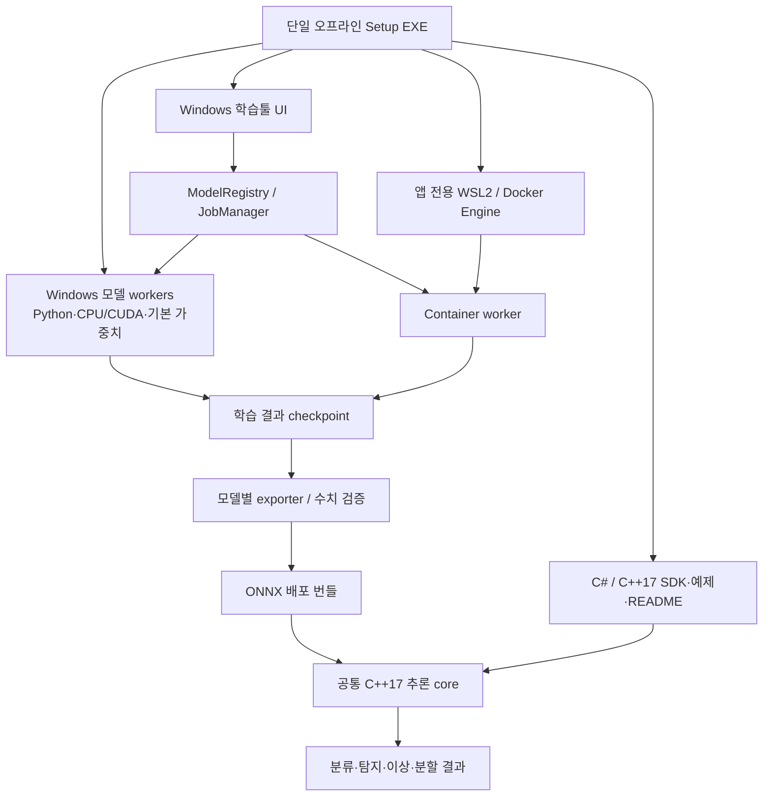

# Windows 학습툴·모델 확장·ONNX C#/C++ 배포 설계

2026-09-18 · 개정 2 · 기준 `d88d275` · 설계 산출물, 구현/Windows 인수 전

관련: [계획](../../01-plan/features/model-packs-windows-distribution.plan.md),
[모델 카탈로그](../../01-plan/features/model-catalog.md),
[동봉 README 초안](../../../packaging/windows/README.ko.md)

## 현재 구현 스냅샷

이번 단계에서 다음 기반 계약은 코드와 회귀 검사까지 연결했다.

- 모델 등록부와 Re-DETR v4 Small/Medium/Large·SAM2 Hiera 전 변형의 명시적 `requested` 카탈로그.
- `DVW1` 프레임, 네트워크 없는 Docker worker, stop→kill→inspect→remove 소유권 정리.
- `.dvmodel` 결정적 빌더, 압축 폭탄·경로·symlink·SHA-256·staging/원자 활성화 검사.
- C++17 `vision_runtime` C ABI와 C# `VisionSession` SafeHandle. generic classify/segment/detect/reconstruction anomaly와 고정 memory-bank PatchCore score/map 결과를 검증한다.
- 오프라인 Windows payload 파일 해시·크기·3.5 GiB 예산 검사.
- EfficientNet GUI/CLI ONNX 검증은 실제 export 그래프와 같은 Conv/BatchNorm 최적화 PyTorch 그래프를 비교한다.
- ResNet 18/50, ConvNeXt V1 Tiny, DeepLab V3+ ResNet34, U-Net ResNet18은 가중치를 포함하지 않는
  native adapter와 공통 ONNX exporter를 사용하며 `builtin` backend manifest를 만든다.

Re-DETR·SAM2의 실제 학습/특수 출력 ONNX 그래프, PatchCore 실제 backbone/bank 학습 계약,
모든 태스크의 C#/C++ 결과 계약,
WiX 단일 EXE 생성과 Windows 실기 검증은 아직 `release_ready`가 아니다. 등록부에 이름이 있다는
이유만으로 해당 모델을 배포 가능하다고 표시하지 않는다.

## 1. 제품 계약과 결정

사용자가 지정한 모든 기본 모델군은 학습·추론·ONNX 내보내기·C#/C++ 배포가 출시 요건이다.
지원 완료는 변형별 Windows 실증 후에만 표시한다. 설치는 모든 기본 모델과 필요한 프로그램을 포함한
오프라인 Setup EXE 하나로 제공한다. 모델을 제외하거나 설치 후 다운로드하면서 같은 요구를 충족했다고 하지 않는다.

기본 모델은 Windows native worker에서 CPU/CUDA로 실행한다. 런타임 차이는 독립 프로세스와 버전별
runtime ID로 분리한다. Docker는 나중에 추가할 모델을 위한 별도 실행 방식이다.
C#/C++ 추론에는 학습툴·Python·Docker가 필요하지 않도록 ONNX와 native SDK만 배포한다.

## 2. 구성



Qt를 기본 응용 UI로 유지한다. 기존 로컬 웹 UI도 같은 등록부·작업 계약을 사용한다.
UI 프로세스는 무거운 학습 라이브러리를 직접 import하지 않는다. 프로젝트/데이터 편집·렌더링과
모델 실행을 분리해 worker의 DLL 충돌이나 학습 실패가 앱 전체를 종료시키지 않게 한다.

## 3. 코드 구성과 이전

```text
model_sdk/
  schemas/manifest.schema.json
  schemas/job.schema.json
  contracts/                       # image, classification, detection, anomaly, semantic, prompted
  worker_protocol.py
model_runtime/
  registry.py                      # 목록·상태·호환성·버전
  installer.py                     # 팩 검증·활성화·롤백
  assets.py                        # 로컬 가중치 조회
  manager.py                       # worker 준비·큐·자원·취소
  windows_worker.py
  container_worker.py
  managed_wsl.py
model_adapters/
  efficientnet/
  resnet/
  convnext_v1/
  libre_classification/
  patchcore/
  detr/                            # 정확한 family 확인 후 구현체 고정
  libre_detection/
  sam2/
  deeplab_v3plus/
  unet/
cpp/
  include/vision_runtime.h          # 다중 태스크 C++ API
  include/vision_runtime_c.h        # 고정 C ABI
  src/model_session.cpp
  src/preprocess.cpp
  src/postprocess.cpp
  src/sam_session.cpp
sdk/csharp/                        # SafeHandle 기반 C ABI 래퍼·NuGet·예제
packaging/windows/
  bootstrapper/                    # WiX Burn 후보, 오프라인 orchestration
  manifests/                      # 파일·런타임·가중치·라이선스 잠금
  profiles/                       # native CPU/CUDA 및 managed WSL
  README.ko.md
  collect_payloads.py
  validate_payloads.py
```

새 경로는 구현 목표다. 현재 `training_modes.py`, `webapp/server.py`, `webapp/worker.py`,
GUI의 모델 분기를 등록부로 옮긴다. 기존 엔진을 먼저 adapter로 감싸 수치·프로젝트 회귀를 검사한다.
현재 `VisionInference`/`ClassificationWorker`는 호환 API로 유지하고 새 공통 core에 위임한다.
기존 `python/onnx_classifier.py` schema 5 검사는 해당 adapter 안에서 유지하며 이름 검사만 제거해 범용화하지 않는다.

## 4. 모델 등록부·학습 UI

카탈로그는 `task → family → variant → training_profile → runtime`을 제공한다.
LibreYOLO처럼 library와 architecture가 다른 항목은 화면에도 둘을 표시한다.
사용 가능한 모델만 골라 쓰게 하되, 누락 파일·호환 불가·미검증 상태도 이유를 볼 수 있게 한다.

선언 필드:

- `id/version/content_hash`, source revision, runtime ID, OS/arch/CPU/GPU 요건.
- `train/infer/export/resume/fit/gradcam` capabilities와 실제 지원 학습 옵션.
- 이미지·라벨·태스크·output schema, 입력 크기/채널·클래스 순서.
- 전처리·후처리·score 계약의 ID/버전.
- 초기 가중치와 학습 결과의 구분, asset hash·크기·출처·재배포 검토 상태.
- 지원 shape/batch/정밀도/opset/ORT 범위, 연산/custom op 요구.
- 검증 결과와 지원 상태, 라이선스/NOTICE/SBOM 참조.

학습 옵션은 허용된 JSON Schema 숫자·범위·enum·boolean·기본값으로 폼을 생성한다.
학습 재개는 model/runtime/optimizer schema가 일치할 때만 활성화한다.
PatchCore는 fit/bank 갱신으로 표시한다. SAM2는 객체 mask와 prompt 설정을 별도로 표시한다.
Grad-CAM과 자동 분할 같은 부가 기능은 모든 모델에 임의 활성화하지 않는다.

## 5. Windows worker와 의존성

서명·검증된 내장 worker launcher가 번들 runtime의 절대 경로로 프로세스를 시작한다.
각 runtime은 자체 Python/torch/torchvision/SMP/Libre/SAM 의존 버전을 잠근다.
호환되는 adapter는 같은 runtime ID를 공유할 수 있지만 버전 충돌을 억지로 한 환경에 넣지 않는다.
동일 내용의 런타임·가중치는 installer의 content hash 저장소에서 중복 수집하지 않는다.

CPU/CUDA 처리 방식은 P0에서 같은 PyTorch CUDA 번들의 CPU 경로를 먼저 검증한다.
CPU만 있는 PC에서 드라이버 DLL 누락 때문에 import가 실패하지 않아야 한다. 별도 CPU 런타임이 필요하면
그 크기도 단일 EXE 예산에 포함한다. CUDA/cuDNN의 재배포 허용 DLL만 번들하고 CUDA Toolkit 설치는 요구하지 않는다.
호스트 NVIDIA 드라이버는 장비 사전조건이며 번들 CUDA runtime으로 대체되지 않는다.

Windows `spawn`, `multiprocessing.freeze_support`, `__main__` guard, frozen worker 실행 모드를 검증한다.
최소 프로필에서는 DataLoader workers=0으로 시작하고 프로세스형 loader는 통과한 프로필에서만 사용한다.
앱이 다시 뜨는 재귀 spawn, 부모 종료 후 고아 worker, DLL 검색 경로 오염을 막는다.
Windows Job Object로 소유 프로세스를 묶고 정상 취소 뒤 남은 자식 프로세스를 종료한다.

SAM2는 공식 Windows native 보장이 아닌 제품 검증 과제다. WSL 권장 upstream을 그대로 감춘 채 native 지원이라
표시하지 않는다. 순수 PyTorch 학습 경로, attention/AMP, 선택 CUDA extension 대체, 작은 후처리까지
native worker에서 실증해야 한다. 실패 시 기본 모델을 몰래 Docker 전용으로 변경하지 않고 P0 미통과로 남긴다.
[공식 SAM2 설치](https://github.com/facebookresearch/sam2/blob/main/INSTALL.md)

## 6. 공통 작업 프로토콜

논리 명령은 `hello`, `describe`, `prepare`, `train`, `infer`, `export`, `cancel`, `close`다.
작업에는 request/job/frame ID, model ref, dataset snapshot, seed, 파라미터, 출력 경로, checkpoint ref가 들어간다.
progress는 epoch/step/metrics/status, 결과는 task payload·timings·runtime ID·artifact refs로 반환한다.
stdout은 바이너리 프레임 전용, stderr는 제한된 로그 전용이다. UI 프레임워크 객체를 worker로 넘기지 않는다.

```text
4 bytes magic DVW1
4 bytes little-endian JSON header length
8 bytes little-endian binary payload length
UTF-8 JSON header
binary payload
```

header 기본 상한 64 KiB, 이미지 payload 기본 상한 64 MiB를 협상한다. 대형 mask/weights는 작업 폴더의
artifact ID로 전달한다. partial read/write·EOF·timeout·손상된 길이를 처리하고 단일 writer가 프레임을 직렬화한다.
이미지는 raw RGB/GRAY 또는 명시한 encoded 포맷이며 base64를 쓰지 않는다. host/worker가 형상·dtype·stride를 검증한다.

수명주기: `VERIFIED → STARTING → WARMING → READY → BUSY → READY → STOPPING → STOPPED`.
실패는 원인이 있는 `FAILED`, 취소는 `CANCELLING → CANCELLED`다. 모델은 한 번 준비해 반복 사용한다.
학습 중에도 취소 명령을 읽을 수 있도록 제어 루프를 연산 루프와 분리한다.
큐 기본 대기 한도는 2, 가득 차면 명시적 busy 결과를 반환하며 검사 프레임을 몰래 버리지 않는다.
단일 worker가 모델과 scratch buffer를 소유하고 CPU 학습/저지연 추론의 자원 경쟁을 기본적으로 제한한다.

## 7. 데이터·결과 계약

| 태스크 | 입력/결과 |
|---|---|
| 분류 | 이미지 → logits/probabilities 구분, class_id·confidence·클래스 순서 |
| 탐지 | 이미지 → 원본 xyxy·class_id·confidence, decode/NMS 수행 위치 명시 |
| 이상 | 이미지 → raw/calibrated score·threshold·판정·원본 대응 heatmap |
| semantic 분할 | 이미지 → 클래스 인덱스 mask 또는 binary mask, background/ignore index |
| prompted 분할 | 이미지와 point/box/이전 logits → mask(s)·quality·좌표 복원 정보 |

이미지 계약에 색순서, 1/3채널 변환, resize/crop/letterbox, 보간·반올림, padding, NCHW/NHWC,
mean/std, 원본 크기와 좌표 변환을 고정한다. segmentation label 보간은 nearest 규약이다.
프레임워크별 전처리를 하나의 stretch 코드로 강제로 통일하지 않고 계약별로 구현한다.
Python/C++/C#은 같은 golden fixture를 사용한다. softmax/sigmoid/NMS의 이중 적용을 막는다.

## 8. ONNX 내보내기와 배포 번들

사용자가 학습하고 선택한 checkpoint의 hash를 기록한 뒤 exporter가 그 파일을 읽는다.
초기 pretrained를 잘못 export하지 않도록 학습 변경과 선택된 checkpoint를 검사한다.
모델별 exporter가 FP32 기준 그래프를 만들고 checker·ORT load·수치·task metric 검증 후에만 활성화한다.
INT8/FP16은 별도 검증 프로필이다. 실패했다고 tolerance를 자동 확대하거나 출력 일부만 검사하지 않는다.

```text
<model>.dvdeploy/             # 디렉터리 또는 같은 내용의 zip
  manifest.json
  model.json                 # 전처리·후처리·클래스·threshold·shape 계약
  graphs/*.onnx
  graphs/*.data              # external tensor data가 있으면 필수
  validation/report.json
  checksums.json
  licenses/...
  README.ko.md
```

ONNX 지원은 반드시 하나의 `.onnx` 파일이라는 뜻은 아니다. SAM2의 두 그래프와 PatchCore bank/external data처럼
필수 구성요소를 묶어 C#/C++에서 완전하게 실행해야 한다. 모델과 떨어진 external data의 경로/hash도 검증한다.
새로운 custom op가 필요하면 Windows DLL·라이선스·C#/C++ 로딩 검증까지 팩의 필수 자산에 넣는다.
먼저 표준 ONNX 연산만으로 완성하는 것을 우선한다.

PatchCore는 backbone·bank·kNN·upsample·Gaussian·score를 포함하는 전체 ONNX를 기본 인수 조건으로 한다.
현재 점수 의미를 고정하고 224/batch1/bank≤4096부터 메모리·수치 검증을 수행한다.
대형 bank용 native kNN hybrid는 별도 프로필이며 전체 ONNX 지원 검증을 대체하지 않는다.

SAM2는 encoder/decoder 두 그래프와 prompt 변환을 제공한다. image hash·model hash·입력 규약이 일치할 때만
embedding을 재사용하고 다른 이미지/모델에서는 폐기한다. decoder 출력 quality와 multiple mask 선택 규칙을
명시한다. 영상 memory state는 별도 미확정 범위이며 이미지 exporter 성공으로 지원 완료를 선언하지 않는다.
SAM2 결과는 `low_res_mask_logits`와 선택 mask index를 제공한다. 기본 1024 프로필은 이미지당
FP32 `[M,256,256]`을 SDK 규약으로 정규화하고 원시 그래프의 batch 축/shape는 manifest에 기록한다.
이진 mask나 원본 크기로 확대한 mask를 이전 logits 대신 사용하지 않는다. `image_context`에는
image_embeddings뿐 아니라 decoder가 요구하는 image_features_0/1도 함께 보관한다.
[ORT decoder 계약](https://github.com/microsoft/onnxruntime/blob/main/onnxruntime/python/tools/transformers/models/sam2/image_decoder.py)

기존 자동 ONNX 준비 실패 시 검증된 PyTorch 경로로 복구하는 동작은 유지한다.
독립 C#/C++ 제품에는 Python fallback을 가정하지 않는다. load/export 검증 실패를 명확한 오류로 반환한다.
새 팩의 다른 엔진 fallback은 같은 계약·checkpoint로 사전에 검증된 경우만 허용한다.

## 9. C++17과 C# SDK

공통 C++17 core가 ORT 세션·전후처리·다중 그래프·좌표 변환을 소유한다.
C++ wrapper와 C ABI를 제공하고 C#은 C ABI의 SafeHandle 래퍼를 기본 경로로 사용한다.
두 언어에서 별도 전처리를 다시 구현하여 결과가 달라지는 것을 피한다.
원하는 사용자를 위해 ORT C# 직접 실행 예제도 제공하되 동일 fixture로 검증한다.
[ORT C#](https://onnxruntime.ai/docs/get-started/with-csharp.html),
[ORT API](https://onnxruntime.ai/docs/api/)

C ABI 개념:

```text
dv_create_session(bundle_path_utf8, options, out session)
dv_infer(session, image_view, request, out result)
dv_sam_encode(session, image_view, out image_context)
dv_sam_segment(session, image_context, prompts, out result)
dv_release_result(result)
dv_release_image_context(image_context)
dv_close_session(session)
```

모든 함수는 오류 코드와 구조화된 상세 오류를 반환하고 C++ 예외를 ABI 밖으로 넘기지 않는다.
문자열은 UTF-8, 타입은 고정 폭 정수/명시적 struct_size·abi_version·stride를 쓴다.
결과 메모리는 생성한 라이브러리에서 해제한다. image_view는 동기 호출 동안 유효해야 하며
비동기 Submit은 이미지 복사 또는 명시적 소유권 이전을 계약으로 둔다.
C# wrapper는 Dispose/SafeHandle과 pin 수명, 취소, thread 안전성을 보장한다.

세션은 재사용하고 같은 세션의 동시 실행은 직렬화한다. 작업별 frame ID·queue time·total time을 제공한다.
C++의 기존 background 기능은 OS 서비스가 아닌 프로그램 안의 worker다.

SDK 기본 인수 대상은 Windows x64, C++17/MSVC Release와 C# .NET 10 LTS다.
.NET Framework 4.8은 C ABI 호환 shim의 후속 검증 대상으로 남기며 미검증 지원을 표시하지 않는다.
C# 데모는 self-contained로 빌드해 데모 실행 PC에 .NET 추가 설치를 요구하지 않는다.
SDK를 개발 프로젝트에 통합할 개발자는 해당 C#/C++ 빌드 도구가 필요하지만 학습툴 사용자는 필요 없다.
[.NET 지원 정책](https://dotnet.microsoft.com/en-us/platform/support/policy/dotnet-core)

## 10. Docker 추가 모델과 관리형 WSL

추가 모델 팩은 `.dvmodel` 안에 manifest·이미지 archive·로컬 가중치·검증 보고서·고지를 담는다.
기본 worker와 같은 task/protocol/schema를 구현하면 UI 재빌드 없이 목록에 나타난다.
새 출력 종류/특수 UI가 필요한 모델까지 manifest만으로 자동 지원한다고 약속하지 않는다.

단일 installer는 배포 가능한 오프라인 WSL MSI, 앱 전용 `.wsl` distro, 고정된 Docker Engine/Moby,
containerd/runc와 필요한 NVIDIA Container Toolkit 구성을 제공한다. Docker Desktop을 무단 내장하지 않는다.
Linux 이미지 안의 `.so`를 Windows DLL처럼 불러오지 않는다.
[WSL 오프라인 설치](https://learn.microsoft.com/en-us/windows/wsl/install#offline-install),
[자체 distro](https://learn.microsoft.com/en-us/windows/wsl/build-custom-distro),
[Docker Engine 설치](https://docs.docker.com/engine/install/ubuntu/)

WSL 시스템 구성요소·가상화 활성화는 관리자 권한과 재부팅이 필요할 수 있다. 재부팅 뒤 같은 설치 상태를 이어간다.
BIOS 가상화·기업 정책·Windows edition/build·호환 드라이버는 설치 전 검사한다. 기존 사용자 distro/Engine을
덮어쓰거나 임의로 업그레이드하지 않는다. 앱 전용 distro는 고정 이름 대신 제품·사용자 고유 ID로 관리한다.
WSL distro는 Windows 사용자별로 등록된다. OS 구성요소/Program Files만 elevated로 설치하고,
distro 등록·VHDX·Engine 초기화는 실제 앱 사용자의 SID와 비상승 세션에 연결한다.
재부팅 후에도 해당 SID로 이어가며 두 번째 사용자는 첫 실행 때 이미 설치된 오프라인 자산으로 자동 초기화한다.
다른 관리자 자격증명으로 UAC한 설치와 두 번째 사용자 첫 실행을 인수 테스트에 포함한다.
[WSL 사용자별 환경](https://learn.microsoft.com/en-us/windows/wsl/setup/environment)
Engine은 전용 Unix socket에서만 듣고 외부 TCP Docker API를 열지 않는다.
호스트 broker는 `wsl.exe -d <owned-distro> -- docker ...`의 인수 배열로 호출한다.

Windows GPU driver를 WSL에서 사용하며 Linux display driver를 distro에 넣지 않는다.
Windows GPU 지원과 WSL GPU 지원은 별도로 검사한다.
[NVIDIA WSL](https://docs.nvidia.com/cuda/wsl-user-guide/index.html)

오프라인 팩의 image archive hash·서명·플랫폼 `linux/amd64`를 검증한 뒤 load한다.
archive hash, registry digest, local image ID는 서로 다른 필드다. 실행은 고정한 image ID를 사용하며 pull하지 않는다.
다른 모델의 이미지는 공유 layer와 content hash 기준으로 중복을 줄인다. 사용자 가중치·데이터는 이미지에 bake하지 않는다.

worker 실행 정책은 `--network none`, `--pull=never`, `--read-only`, `--cap-drop=ALL`,
`--security-opt=no-new-privileges`, `--log-driver=none`, `--init`, `-i`이며 TTY를 쓰지 않는다.
모델/데이터는 필요한 폴더만 RO, 해당 작업 결과는 RW, `/tmp`는 제한된 tmpfs로 제공한다.
Docker socket이나 전체 드라이브를 mount하지 않는다. 이미지 payload가 daemon 로그로 복제되지 않게 한다.
[네트워크 격리](https://docs.docker.com/engine/network/drivers/none/),
[로그 설정](https://docs.docker.com/engine/logging/configure/)

worker stdin/stdout으로 통신하며 네트워크 포트가 필요 없다. 학습 데이터의 Windows/WSL 파일 I/O가 병목이면
사용자가 볼 수 있는 로컬 staging 복사본을 만들고 보존·삭제 정책을 제공한다. 원본은 변경하지 않는다.
container ID·소유 label을 기록하고 취소/종료는 정상 stop→timeout→kill→inspect→remove 순서로 처리한다.
attached docker.exe 종료나 pipe EOF만으로 컨테이너 종료를 가정하지 않는다. 앱 재시작 시 자기 소유 고아만 정리한다.
WSL/Engine의 업데이트·보안 수정·디스크 정리도 제품 유지보수 범위다.

## 11. 팩 설치·프로젝트·신뢰

팩에는 schema/sdk 버전, 호환 앱 버전, model/task/runtime/contract ID, assets와 hash·크기,
license/SBOM, signer 정보가 들어간다. 지원하지 않는 major 계약은 거부한다.
manifest가 임의 shell/Python import/URL을 호스트에서 실행하게 하지 않는다.

설치는 staging→경로/대소문자 중복/압축폭탄/용량 검사→서명/모든 hash→호환성→준비 smoke→버전 확정→활성 registry
원자 갱신 순서다. 공식 팩은 내장 신뢰 키, 사내 팩은 관리자가 등록한 키로 검증한다.
미서명 개발 팩은 명시적 개발 모드로 분리한다. 체크섬만 맞는 것을 신뢰된 제작자라고 하지 않는다.

프로젝트는 `{model_id, pack_version, content_hash, runtime_id, training_profile, checkpoint_ref}`를 고정한다.
업데이트는 새 버전을 병렬 설치하고 실행 중인 버전을 바꾸지 않는다. 기존 프로젝트 로드 때 원본을 자동 덮어쓰지 않는다.
저장 시 schema migration 기록과 백업을 남긴다. 불명확한 구형 설정은 다른 모델로 조용히 치환하지 않는다.

## 12. 설치 구성·한 파일 제약

```text
DeepVisionStudio-Setup-<version>-win-x64.exe  # 유일한 필수 설치 파일
  [내장 payload]
  app / native workers / CPU·CUDA dependencies
  모든 기본 model manifests / 승인된 pretrained assets
  VC runtime / WSL offline components / owned distro + Docker Engine
  C++ SDK / C# SDK·self-contained demos / README / licenses / SBOM
```

WiX v4 이상 중 검증한 버전을 고정한 Burn의 여러 attached container를 후보로 사용하고 OS 설치 사전조건과 native/WSL 설치 단계를 묶는다.
MSI/CAB의 개별 한도와 최종 PE 서명 한도를 실제 payload로 검사한다. NSIS 약 2 GB 한계를 전제로 했던 설계는 폐기한다.
[WiX container](https://docs.firegiant.com/wix/schema/wxs/container/),
[WiX 대형 번들 이슈](https://github.com/wixtoolset/issues/issues/6144),
[Windows 서명 제약](https://learn.microsoft.com/en-us/windows/msix/package/signing-known-issues)

P0의 단일 EXE 실증에는 runtime·기본 가중치·WSL payload를 모두 넣는다. 내부 목표는 3.5 GiB 이하이며 실제
서명 가능 여부·해시·손상 감지·백신 검사·복구까지 확인한다. 범위를 줄인 dummy installer로 완료 처리하지 않는다.
한도를 넘으면 미사용 패키지 제거·공유 runtime/encoder 가중치 중복 제거·압축을 적용한다.
그래도 초과하면 단일 EXE 조건은 미해결이다. 외부 payload/인터넷 다운로드/ISO로 묵시적으로 바꾸지 않는다.

설치 흐름: 사전 진단→사용 범위/고지 확인→disk budget 계산→내장 파일 검증·해제→VC/앱/worker/가중치 설치
→WSL/가상화 준비→필요 시 재부팅 이어가기→실제 사용자 세션에서 owned distro/Engine 초기화
→오프라인 smoke→바로가기·완료 보고.
가상화 불가 PC는 native 기능만 실행할 수 있지만 Docker까지 포함한 전체 요구 충족으로 표시하지 않는다.
지원사양 충족 PC에서는 사용자에게 별도 다운로드나 패키지 설치를 요구하지 않는 것이 인수 조건이다.

대상은 시스템 전체 설치를 위한 관리자 Setup과 비관리자 앱 실행이다.

```text
%ProgramFiles%/DeepVisionStudio/<version>/  # 앱·worker·기본 팩·SDK·고지, 실행 중 수정 금지
%LOCALAPPDATA%/DeepVisionStudio/            # registry·추가 팩·jobs·logs·cache·settings·owned WSL VHDX
사용자 프로젝트 폴더/                     # 원본 데이터·.dvproj·학습 결과
```

설치 시 디스크 예산은 installer+해제 임시공간+설치물+rollback cache+VHDX+이미지+작업공간을 합산한다.
업데이트/제거는 사용자 프로젝트·추가 팩·학습 결과를 보존한다. owned distro 삭제는 내용과 결과를 안내한 별도 선택이며
Windows 전역 WSL 기능이나 다른 배포판을 함께 제거하지 않는다.

## 13. pretrained·third-party·빌드 재현성

빌드 manifest가 실제 포함할 코드·wheel·DLL·checkpoint·WSL/OS package의 버전·hash·출처·고지·소스 의무를 나열한다.
`pip install ...[all]`로 불필요하거나 제한된 모델/코드를 일괄 묶지 않는다.
model asset resolver는 프로젝트 지정 로컬 가중치→선택 팩 자산→동일 hash 로컬 캐시 순서로 조회한다.
오프라인 모드에서 누락되었다고 hub/download API를 호출하지 않는다.

기본 분할 모델의 encoder 초기화와 완성된 task 가중치, PatchCore pretrained backbone과 학습 후 bank를 구별한다.
라이선스가 불명확한 기본 후보는 조용히 제외하고 제품을 완성했다고 하지 않는다. 권리 확인 또는 대체 자산 결정을
출시 전 해결해야 한다. 사용자 비공개 가중치/이미지는 공개 CI·공개 릴리스로 보내지 않는다.

Qt의 고지·해당 소스 제공/교체 권리, CUDA EULA의 재배포 파일 범위, VC redistributable 약관,
WSL/Moby/distro/kernel의 각 조건, 모든 모델 가중치 조건을 실제 배포 파일 기준으로 검토한다.
Docker로 격리하거나 ONNX로 변환했다고 기존 조건이 없어지는 것은 아니다.
[Qt LGPL](https://www.qt.io/development/open-source-lgpl-obligations),
[CUDA EULA](https://docs.nvidia.com/cuda/eula/),
[VC 재배포](https://learn.microsoft.com/en-us/cpp/windows/redistributing-visual-cpp-files?view=msvc-170),
[TorchVision 가중치](https://github.com/pytorch/vision#pre-trained-model-license)

릴리스 빌드는 Windows runner에서 고정 도구/패키지로 만들고 Git commit, dependency locks, asset hashes,
빌드 옵션, 결과 hashes, SBOM을 남긴다. 서명 인증서는 저장소/worker/이미지에 넣지 않는다.
기본 worker·bootstrapper·SDK DLL/EXE를 서명하고 실제 설치파일 Authenticode를 검증한다.

## 14. 최소사양과 검증 프로필

README의 숫자는 초기 실증 기준이며 측정 없이 보장 최소값이라고 표시하지 않는다.
최종 README는 installer의 실제 disk budget과 모델별 성공한 학습 프로필에서 생성한다.

| 수준 | 설계 검증 기준 |
|---|---|
| UI/라벨링/경량 CPU 추론 | 지원 중인 Windows 11 x64, AVX2 4코어 CPU, RAM16GB, SSD 여유50GB+데이터 |
| 기본 모델 GPU 학습 | AVX2 8코어 CPU, RAM32GB, CUDA 지원 NVIDIA GPU VRAM12GB, SSD 여유100GB+데이터 |
| SAM2 전체 fine-tune/고해상도 권장 검증 | RAM64GB, VRAM24GB, NVMe 여유200GB+데이터 |
| Docker 확장 조건 | WSL2/SLAT 지원·가상화 활성화·관리자 설치·기업 정책 허용·추가 image 공간 |

12GB가 모든 변형·해상도·batch의 학습을 보장하지 않는다. 최소 인수 프로필은 카탈로그의 작은 변형,
batch1, 분류224(B1 240), 탐지640 후보, semantic512, PatchCore224/bank≤4096,
SAM2 Tiny1024/encoder freeze + decoder fine-tune으로 시작한다.
GPU별 지원 compute capability/driver 최소 버전은 선택한 torch/CUDA wheel의 실제 지원 목록과 테스트 후
release-manifest/README에 구체적인 버전으로 고정한다. 그 값이 미정이면 정식 README/릴리스는 미완료다.

## 15. 테스트와 지원 완료 판정

- 인터넷 차단된 Windows VM/실기, 개발 도구·Python·CUDA Toolkit·Docker 없는 상태에서 Setup 실행.
- 기본 모델마다 로컬 pretrained 로드→작은 데이터 학습/fit→변경된 checkpoint→재로드/재개→추론→ONNX.
- C++17 Release와 C# self-contained에서 Python/Docker 없이 모든 태스크를 실행하고 기준 출력 비교.
- SAM2 point/box/negative prompt/embedding cache/빈 mask, semantic binary/multiclass/ignore index,
  탐지 decode/NMS/비정사각 좌표, PatchCore bank 1/최대/k 초과/threshold/zero distance 검증.
- 모델별 absolute/relative tolerance와 task metric 기준을 수치 검증 전에 고정. 미달을 자동 완화하지 않음.
- 설치 경로 한국어/공백, 비관리자 실행, 읽기 전용 Program Files, Windows spawn/재부팅/설치 rollback 검사.
- 서로 다른 dependency의 Docker 팩 두 개 오프라인 추가, CPU/GPU, 취소/crash/고아·로그·네트워크 격리 검사.
- updater가 프로젝트 model ref를 바꾸지 않음, 팩 손상/허용 밖 경로/미지원 ABI 거부, 제거 시 사용자 데이터 보존.

타이밍은 setup/queue/decode/transport/preprocess/model/postprocess/request-total/display를 구분한다.
서로 다른 프로세스의 clock 원점을 빼지 않고 host 전체시간과 worker duration을 별도 측정한다.
배포 SDK의 core 시간과 추론 버튼 전체시간을 모두 기록하며 B0 8ms 목표를 다른 모델의 보장으로 확장하지 않는다.

P0 미통과 항목과 Re-DETR v4/SAM2의 실제 upstream·checkpoint·Windows runtime 검증은 구현의 남은 작업으로 표시한다.
설계 문서가 완성되었다는 이유로 실행코드·EXE·모델별 Windows 검증이 완료되었다고 표시하지 않는다.
