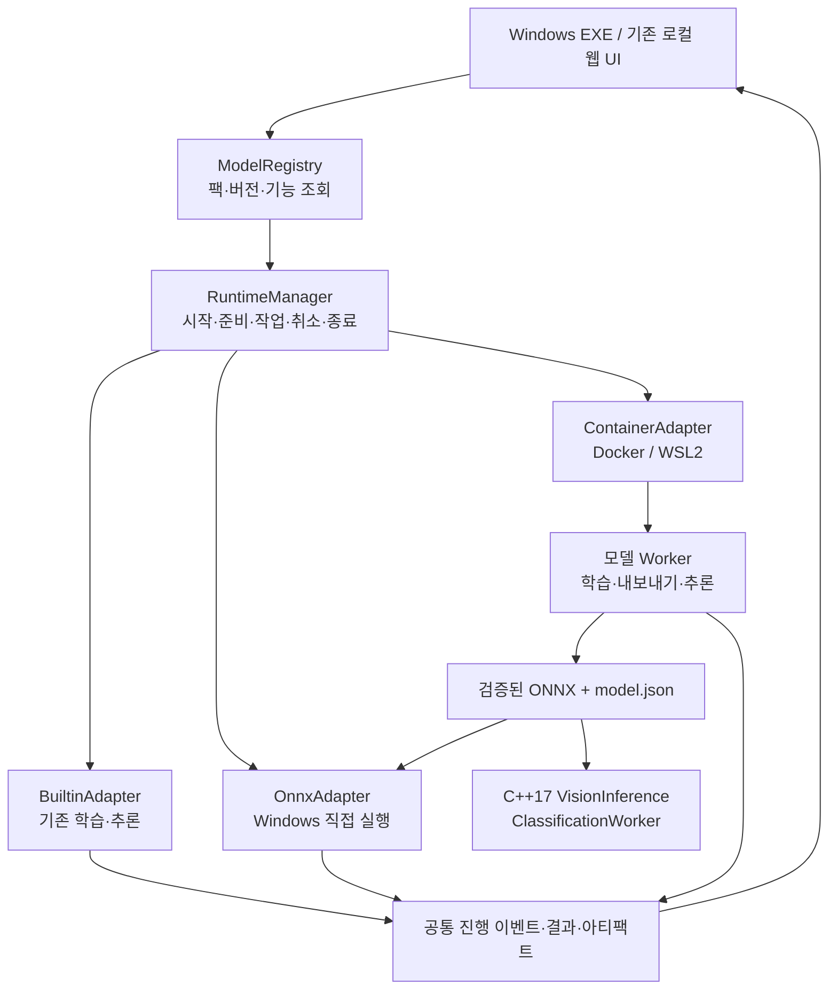

# 모델 팩과 Windows EXE 상세 설계

작성일: 2026-09-18 · 기준: `73e680f` · 상태: 설계안 작성 완료, 실행 코드 구현 전

관련 문서: [계획](../../01-plan/features/model-packs-windows-distribution.plan.md)

## 1. 설계 결정

1. EXE 본체는 현재 Qt/Python 앱을 유지한다. 기존 CPU 학습·추론·Grad-CAM·PyTorch fallback을 포함한다.
2. 모델 팩 `.dvmodel`을 등록하면 GUI와 웹에 지원 태스크·학습 옵션이 나타나게 한다.
3. 실행 방식은 `builtin`, `onnx`, `container`로 나눈다. 사용자 화면에서는 실행 가능한 기능과 준비 상태를 보여준다.
4. Docker/WSL2는 선택 의존성이다. 새 모델의 학습·내보내기와 특수 런타임에 사용한다.
5. 지연시간에 민감한 C++17 추론은 ONNX Runtime을 프로그램 안에서 직접 호출한다.
6. 배포는 PyInstaller `onedir`를 NSIS 설치 EXE로 포장한다. 대용량 모델 팩은 설치기 옆 오프라인 파일로 분리할 수 있다.
7. 프레임워크·DLL·가중치의 버전과 파일 hash를 고정한다. 모델 이름만 같다는 이유로 새 버전을 자동 적용하지 않는다.

`Model Pack`은 Docker 이미지와 동의어가 아니다. 모델·가중치·입출력 규약·실행 방법을 설명하는 배포 단위다.
팩이 필요로 할 때 Docker 이미지가 포함되며, ONNX 팩은 Docker 없이 실행된다.

## 2. 전체 구조



Docker Worker는 UI 객체를 알지 못한다. Qt 없는 `TrainingEvents`, `InferenceResult` 및
현재 작업 관리자(`gui/core/training_engine.py`, `desktop_jobs.py`, `webapp/jobs.py`)를 연결 지점으로 삼는다.
모델 등록부는 Qt나 FastAPI에 의존하지 않는 공통 모듈로 둔다.

## 3. 새 파일과 기존 변경 위치

다음은 구현할 경로이며 현재 존재하는 기능으로 표시하지 않는다.

```text
model_sdk/
  manifest.schema.json       # 팩 메타데이터
  contracts/                 # 태스크별 입출력·학습 이벤트
  adapter.py                 # 실행기 공통 인터페이스
  worker_protocol.py         # 프레임 송수신
model_runtime/
  registry.py                # 팩 탐색·호환성·버전 선택
  installer.py               # 안전한 추출·검증·원자적 활성화
  assets.py                  # 가중치와 데이터 파일 조회
  manager.py                 # 수명주기·자원·작업 관리
  adapters/
    builtin.py
    onnx.py
    container.py
model_packs/builtin/         # 기존 모델의 manifest, 사용자 가중치는 제외
packaging/windows/
  DeepVisionStudio.spec
  installer.nsi
  profiles/                 # Windows CPU 잠금 파일·빌드 설정
  collect_assets.py
  collect_notices.py
tools/model_pack.py          # 개발자용 validate/build/verify 명령
tests/model_packs/           # 계약·호환성·업데이트·복구 검증
```

기존 `training_modes.py`는 등록부를 조회하는 호환 창구로 남긴 뒤 고정 분기를 점진적으로 제거한다.
`webapp/server.py`의 options와 Qt 모델 선택 UI도 같은 capability 응답을 사용한다.
`python/onnx_classifier.py`의 기존 schema 5 검증을 삭제하지 않는다. 기존 EfficientNet 어댑터로 유지하고
새 계약을 지원하는 범용 실행기를 별도로 추가한다.

## 4. 모델 팩 형식과 식별

`.dvmodel`은 버전이 있는 ZIP 컨테이너다. 데이터만 있는 팩과 실행 이미지가 있는 팩이 같은 최상위 규약을 쓴다.

```text
manifest.json
checksums.json
signature.json
artifacts/model.onnx         # 추론 가능한 팩에 포함, external data도 manifest에 열거
artifacts/model.json         # 전처리·출력·클래스·런타임 계약
weights/pretrained.pth       # 초기 학습용 가중치, 포함 가능 여부 검토 필요
runtime/image.tar           # container 팩만 포함, linux/amd64
validation/report.json
licenses/THIRD_PARTY_NOTICES.html
licenses/...
sbom.cdx.json
```

컨테이너에는 실행 환경과 코드만 넣고, 비공개 가중치·데이터·학습 결과는 로컬 mount로 전달한다.
동일 image hash의 팩 여러 개는 검증된 이미지 저장소를 공유한다.

manifest의 핵심 필드:

| 필드 | 의미와 검증 |
|---|---|
| `schema_version`, `sdk_api` | 구조 버전과 worker 계약 버전; 모르는 major는 거부 |
| `id`, `version`, `publisher` | 소문자 ID·SemVer·발행자 식별; 같은 버전의 다른 내용은 충돌 |
| `app_compatibility` | 최소/최대 호환 앱·계약 버전 |
| `task`, `capabilities` | train/infer/export_onnx/resume/gradcam, 입력 채널·학습 옵션·선정 지표 |
| `runtimes` | builtin/onnx/container별 필요한 OS·CPU 아키텍처·런타임·opset·연산 |
| `contracts` | 입력·전처리·출력 계약 ID와 버전 |
| `assets` | 파일 역할·상대 경로·크기·SHA-256, external data 포함 |
| `pretrained` | 초기 가중치 원본·버전·학습 데이터 출처·배포 검토 상태 |
| `licenses` | 코드/가중치/컨테이너 OS 패키지의 조건·고지 파일·필요 소스 |
| `validation` | 수치 검증, 실제 환경·데이터 범위·정확도 평가 근거 |

개념 예시(가중치와 hash가 없는 설명용 manifest이며 바로 설치할 수 있는 파일은 아니다):

```json
{
  "schema_version": 1,
  "sdk_api": "1.0",
  "id": "company.example-classifier",
  "version": "1.0.0",
  "task": "classify",
  "capabilities": {"train": true, "infer": true, "export_onnx": true, "resume": true, "gradcam": false},
  "runtimes": {"train": "container", "infer": "onnx", "export": "container"},
  "contracts": {
    "input": "image-u8.v1",
    "preprocess": "opencv-classification.v1",
    "output": "classification-logits.v1"
  },
  "runtime_requirements": {"container_platform": "linux/amd64", "native_platform": "windows/amd64"}
}
```

manifest는 임의 Python import 경로, shell 스크립트 또는 다운로드 URL의 자동 실행을 허용하지 않는다.
컨테이너 entrypoint는 검증된 이미지에 들어 있으며 실행 인수는 호스트 실행기가 구성한다.
데이터 전용 ONNX 팩은 앱에 등록된 전후처리 계약만 선택한다. 새 DLL/custom op를 로드하려면
코드 실행을 포함하는 별도 신뢰·호환성 검증이 필요하다.

`checksums.json`은 자신과 서명 파일을 제외한 모든 팩 파일의 hash·크기를 담는다.
`signature.json`은 발행자 key ID와 정확한 checksums 파일 바이트의 서명을 담는다.
공식 배포는 내장된 신뢰 키로 검증하며, 사내 팩은 관리자가 로컬 신뢰 키를 등록한다.
개발용 미서명 팩은 명시적인 개발 모드에서만 허용한다. 해시 확인만으로 제작자를 신뢰하지 않는다.

## 5. 입출력과 모델 추가의 경계

| 태스크 | 공통 결과 규약 |
|---|---|
| 분류 | 클래스 순서 고정, logits/probabilities 구분, class_id·confidence |
| 박스 탐지 | 원본 좌표계의 xyxy, class_id·confidence, NMS 여부·설정 명시 |
| 시맨틱 분할 | 원본 영상과 대응되는 클래스 인덱스 마스크, background·ignore index 명시 |
| 이상 탐지 | score·threshold·판정, 선택적 원본 좌표 heatmap |
| 회전 박스 | 네 꼭짓점 순서와 원본 좌표를 명시한 계약을 구현한 팩에서만 infer 노출 |

입력에는 shape/dtype/NCHW·NHWC/색상/채널/원본 크기를 명시한다. 전처리 계약은 resize 알고리즘,
stretch·crop·letterbox, mean/std, 1채널 변환 방식, 좌표 복원 정보를 포함한다.
후처리에는 softmax 중복 적용 방지, 클래스 순서, 박스 인코딩, threshold, mask 복원을 명시한다.
같은 이미지가 학습·Python 추론·ONNX·C++에서 같은 규약을 거치도록 계약 fixture를 공유한다.

새 아키텍처라도 기존 계약에 맞는 ONNX라면 앱 재빌드 없이 추가할 수 있다. 새로운 출력 표현이나
특수 시각화·Grad-CAM 계층 탐색이 필요하면 SDK/어댑터 구현이 필요하다. 모든 팩에 학습·resume·Grad-CAM을
강제로 켜지 않고, 실제 지원 기능만 화면에 보여준다. 학습 옵션은 SDK가 허용하는 JSON Schema의
숫자·범위·enum·boolean·기본값으로 선언하여 일반 폼을 만든다. 새 팩이 임의 UI 코드를 로드하게 하지 않는다.

현재 클래스 이름·전처리·입력 채널을 추정하는 관행을 추가하지 않는다. 특히 사전학습 RGB 모델을
1채널 모델로 바꾼 팩은 입력 adapter와 가중치 변환 방식을 명시하고 별도로 검증한다.

## 6. 실행기 API와 작업 수명주기

공통 논리 API:

```text
describe() -> ModelDescriptor
prepare(model_ref, runtime_options) -> ReadyInfo
train(job_spec) -> JobHandle
infer(frame_id, image, inference_options) -> InferenceResult
export(job_spec) -> ArtifactSet
cancel(job_id) -> CancelAck
close() -> Closed
```

`job_spec`에는 팩 참조, 데이터셋 계약·분할·클래스 순서, 파라미터, seed, 저장 폴더,
checkpoint 참조가 들어간다. resume은 해당 팩 버전·학습 상태 형식의 호환 여부를 확인한다.
결과에는 `request_id`, `job_id`, `frame_id`, 상태, 모델/팩/runtime 식별자, 타이밍, 아티팩트 상대 경로가 들어간다.

모델 수명주기: `DISCOVERED → VERIFIED → STARTING → WARMING → READY → BUSY → READY → STOPPING → STOPPED`.
실패 시 원인을 가진 `FAILED`로 전환한다. 학습 중 취소는 `CANCELLING → CANCELLED`로 기록한다.
호스트는 준비 완료 후에만 infer를 받는다. 컨테이너·모델·ONNX 세션을 매 이미지마다 만들지 않는다.

기존 C++ `ClassificationWorker`처럼 모델 실행 자원은 한 worker가 소유한다. 큐 기본 대기 한도는 2이며,
가득 차면 명시적 busy 오류를 반환한다. 검사용 이미지를 몰래 버리지 않는다. 취소 신호 후 설정된 유예시간이
지나면 해당 worker만 종료하고, 완료되지 않은 출력은 최종 결과로 노출하지 않는다.
정상 종료는 대기열 처리/취소 정책을 명시한 뒤 join하며 UI 종료를 무기한 막지 않는다.

## 7. Docker 실행과 통신

첫 지원 범위는 Windows x64 + Docker Desktop WSL2의 Linux 컨테이너다.
CPU 모델은 CPU로, GPU 팩은 검증된 NVIDIA/WSL2 조합에서만 GPU 기능을 노출한다.
`i7` 명칭만으로 GPU 지원이나 적정 thread 수를 결정하지 않는다.

### 오프라인 준비

빌드 환경에서 고정된 base image·패키지·소스를 사용해 이미지를 만들고 `docker image save` archive로 배포한다.
사용자 PC에서는 archive hash와 팩 서명을 확인한 뒤 `docker image load`한다. 태그 문자열에 의존하지 않고,
load 후 OS/architecture와 예상 image ID를 검증한다. registry manifest digest와 로컬 image ID는 별도 필드로
보관한다. archive hash, registry digest, image ID를 서로 같은 값으로 취급하지 않는다.
대상 PC에서 Docker build, pip 설치, image pull 또는 모델 다운로드를 자동 수행하지 않는다.

### 실행 정책

호스트는 Docker 설치·daemon·WSL2·Linux mode·플랫폼·디스크·RAM을 검사한다.
기본 실행 정책은 `--network none`, `--pull=never`, `--read-only`, `--cap-drop=ALL`,
`--security-opt=no-new-privileges`, `--log-driver=none`, `--init`, `-i`이며 `-t`는 사용하지 않는다.
컨테이너 사용자·메모리·CPU·임시 공간 한도를 정하고 필요한 `/tmp`만 tmpfs로 제공한다.
사용자 Docker socket이나 전체 드라이브를 mount하지 않는다.

- `/models`: 선택한 팩/가중치만 읽기 전용.
- `/data`: 사용자가 선택한 데이터셋만 읽기 전용.
- `/work`: 현재 작업의 결과·checkpoint만 쓰기 가능.

경로는 호스트 실행기가 mount별 상대 경로로 변환한다. 한국어·공백·UNC 경로는 실제 Windows에서 검증하고,
허용된 루트를 벗어나는 traversal·symlink·junction을 거부한다. 명령은 shell 문자열이 아닌 인수 배열로 구성한다.
Windows/WSL 파일 경계가 학습 병목이면 로컬 Docker volume에 선택적으로 staging할 수 있다.
추가 복사본의 위치·용량·삭제 정책을 표시하며 기본적으로 사용자 원본을 변경하지 않는다.

### worker 프로토콜 v1

지속되는 stdin/stdout으로 요청을 전달하며 stdout은 프로토콜 전용, stderr는 로그 전용이다.
TCP 포트를 열지 않는다. 초기 `hello` 응답에서 SDK 버전·지원 명령·프레임 한도를 협상한다.

```text
4 bytes magic "DVW1"
4 bytes little-endian unsigned JSON header length
8 bytes little-endian unsigned binary payload length
UTF-8 JSON header
binary payload
```

header에는 `type`, `request_id`, `operation`, `frame_id/job_id`, payload 형식이 들어간다.
응답 type은 `result`, `progress`, `error`, `heartbeat`로 구분한다. 한 writer가 frame을 직렬화하고,
호스트·worker 모두 partial read/write와 EOF를 처리한다. JSON header 기본 한도는 64 KiB,
이미지 payload는 기본 64 MiB로 제한하고 실제 shape·dtype 크기와 일치해야 한다.
큰 데이터셋·ONNX·checkpoint는 작업 폴더의 아티팩트 ID로 전달한다.
일반 이미지 요청은 연속된 raw GRAY/RGB 바이트로 전달하여 base64 변환을 하지 않는다.

취소 명령을 학습 중에도 읽을 수 있도록 worker의 제어 입력 처리와 연산 루프를 분리한다.
로그 소비가 막혀 worker가 멈추지 않도록 stderr를 계속 읽으며 크기 제한과 회전을 적용한다.
프레임 손상·timeout·worker crash는 해당 세션을 실패 처리하고 요청 결과를 확정한다.
모델 준비 실패 후 재시도는 준비 단계까지만 자동화하며 학습/내보내기 작업을 몰래 재실행하지 않는다.
Docker daemon에도 binary stdout이 누적되지 않도록 `--log-driver=none`을 적용하고, 필요한 stderr만
호스트가 제한적으로 보관한다. 이미지/텐서 payload를 진단 로그에 기록하지 않는다.

호스트는 생성한 container ID와 앱·사용자·세션 label을 기록한다. attached docker.exe를 종료하거나
pipe를 닫는 것만으로 컨테이너가 종료되었다고 판단하지 않는다. close/cancel 유예시간 이후에는
해당 ID에 `docker stop --timeout`을 적용하고 필요하면 kill한 뒤 종료를 inspect하고 제거한다.
앱 재시작 시 자신의 이전 세션 label과 소유 기록이 일치하는 고아 컨테이너만 정리한다.
다른 앱이나 사용자의 컨테이너를 일괄 중지하지 않는다.
[Docker 실행 옵션](https://docs.docker.com/reference/cli/docker/container/run/),
[종료 동작](https://docs.docker.com/reference/cli/docker/container/stop/)

이 IPC는 격리된 로컬 실행을 위한 설계다. WSL 경계의 zero-copy 또는 컨테이너의 8 ms 달성을 주장하지 않는다.
`--network none`은 네트워크 격리에 쓰며, localhost 포트 공개만으로 인터넷 송신이 차단된다고 설명하지 않는다.
[Docker 네트워크 없음](https://docs.docker.com/engine/network/drivers/none/)

## 8. ONNX와 C++17 경로

Docker 학습 → export → CPU FP32 기준 수치 검증 → 팩 등록 → Windows ONNX 직접 실행으로 연결한다.
ONNX 파일을 읽을 수 있다는 것과 모델의 전후처리·결과를 지원한다는 것을 구분한다.
표준 계약과 opset/연산 검사에 통과한 모델만 직접 실행 대상으로 표시한다.

검증은 고정 seed fixture와 실제 로컬 검증 데이터의 출력 차이·태스크 정확도를 비교한다.
INT8 등의 최적화 결과는 별도 아티팩트와 허용 기준으로 등록한다. 실패했다고 허용 오차를 자동으로 키우거나
softmax 이후만 비교해서 큰 logits 차이를 숨기지 않는다. 기존 자동 ONNX 준비 실패 시 PyTorch fallback은 유지한다.
새 팩은 대체 엔진이 manifest에 있고 같은 계약으로 검증되었을 때만 fallback을 제공한다.

C++ 사용자는 팩에서 검증된 `model.onnx`, `model.json`, 필요한 external data와 런타임 DLL을 배포한다.
기존 `VisionInference::InitializeFromJson`, `Classify`, `ClassificationWorker` 사용 흐름을 유지한다.
학습용 Docker가 C++ 제품의 실행 전제조건이 되지 않게 한다. 분류 이외의 C++ 백그라운드 태스크 확장은
각 결과 계약별 worker를 추가하는 후속 작업이다.

ONNX 최적화 캐시는 model hash·ORT 버전·provider·CPU 특성·옵션을 포함한 키로 저장한다.
다른 PC에서 만든 하드웨어 의존 최적화 파일을 모든 i7에 적용하지 않고 원본 ONNX를 함께 보관한다.
[ONNX Runtime 오프라인 최적화 제약](https://onnxruntime.ai/docs/performance/model-optimizations/graph-optimizations.html)

## 9. 설치 디렉터리와 데이터 보호

```text
%LOCALAPPDATA%/Programs/DeepVisionStudio/<app-version>/
  DeepVisionStudio.exe
  _internal/                         # Python, Qt, torch CPU, ORT, OpenCV 등
  model-packs/                       # 기본 제공 팩, 앱에서는 수정하지 않음
  licenses/
  release-manifest.json
  Uninstall.exe

%LOCALAPPDATA%/DeepVisionStudio/
  registry/                          # 활성 버전과 신뢰 키
  model-packs/<id>/<version>/         # 사용자가 추가한 팩
  staging/                           # 검증 중인 팩
  jobs/
  logs/
  cache/
  settings/

사용자 지정 프로젝트 폴더/           # .dvproj, 이미지, 학습 결과
```

기본 설치는 사용자 단위로 한다. 회사 전체 설치가 필요하면 관리자가 Program Files 설치 프로필을 선택한다.
실행·설정 저장은 비관리자 권한으로 가능해야 한다. 설치 폴더를 읽기 전용으로 두어도 정상 동작하도록 테스트한다.
필수 VC++ 런타임이 없으면 공식 재배포 패키지의 사전조건 설치가 필요하며 관리자 권한·재시작 여부를 표시한다.

팩 설치 순서: 별도 staging에 추출 → 크기/경로/중복·대소문자 충돌 검사 → 서명·모든 hash 검증 → 호환성 검사
→ 최소 로드 검증 → 버전 디렉터리 확정 → registry를 원자적으로 갱신한다.
실행 중인 팩은 교체·삭제하지 않는다. 업데이트는 새 버전을 병렬 설치하고 다음 준비 시점에 전환한다.
가중치·ONNX external data는 manifest 안에 있는 상대 경로만 참조할 수 있다.

`.dvproj`에는 `model_ref: {id, version, content_hash, runtime}`와 학습 초기 가중치/결과 checkpoint 참조를 저장한다.
구형 프로젝트는 명시된 기존 설정으로만 builtin 팩에 매핑한다. 모호하면 모델 선택을 요청한다.
로드할 때 원본 프로젝트를 덮어쓰지 않고 저장할 때 백업과 버전 기록을 남긴다.
설치 프로그램 제거는 사용자 프로젝트·추가 팩·학습 결과를 기본적으로 보존한다.

## 10. 초기 가중치와 third-party 묶음

`ModelAssetResolver`는 ① 프로젝트가 고정한 로컬 가중치 ② 선택 팩의 assets ③ 동일 hash의 로컬 캐시 순서로
찾는다. 오프라인 배포 모드에서 네트워크 다운로드로 자동 전환하지 않는다. 누락 시 필요한 팩/파일과 hash를
표시한다. 학습 초기 가중치와 사용자가 학습한 최종 가중치를 같은 파일로 덮어쓰지 않는다.

기본 팩 후보는 EfficientNet B0/B1 초기 가중치와 현재 PatchCore 백본 초기 가중치다.
이 목록은 번들 후보이며 재배포 권리 확인 완료를 뜻하지 않는다. 모델/가중치별 상업적 이용·재배포 조건을
확인한 항목만 공개 Setup에 포함한다. 사용자 비공개 가중치는 사내 배포 범위를 유지한다.
TorchVision도 사전학습 모델에 학습 데이터에서 유래한 별도 조건이 있을 수 있음을 명시한다.
[TorchVision 가중치 조건](https://github.com/pytorch/vision#pre-trained-model-license)

포함 항목은 빌드 프로필의 명시적 allowlist로 수집한다.

| 항목 | 처리 |
|---|---|
| Python·PySide6/Qt·NumPy·torch/torchvision·OpenCV·ORT 등 | Windows wheel/DLL 버전·hash·라이선스·고지 수집 |
| C++ ONNX Runtime/OpenCV/MSVC 의존성 | Windows 실제 exe의 DLL 의존 검사 및 배포 규약 확인 |
| 컨테이너 OS·pip 패키지·모델 코드 | 이미지 SBOM과 코드/소스 제공 조건을 팩에 포함 |
| 초기 가중치 | 원본 URL·hash·수정 내역·배포 허용 근거를 코드 라이선스와 분리 |
| Docker Desktop/WSL2/GPU 드라이버 | 시스템 설치 조건으로 안내, 앱의 DLL처럼 임의 재배포하지 않음 |

Qt LGPL 경로는 고지 파일만 복사하는 것으로 끝내지 않는다. 사용 라이브러리의 대응 소스 제공 방식,
교체·재링크와 필요한 사용 권리 등 적용 의무를 배포 정책에 반영한다. 상용 Qt를 선택하면 계약에 맞게 바꾼다.
[Qt LGPL 의무](https://www.qt.io/development/open-source-lgpl-obligations)
VC++ Redistributable은 관련 약관에 따라 공식 오프라인 패키지를 동봉하고 호환 버전 설치 여부를 감지한다.
[Microsoft C++ 재배포](https://learn.microsoft.com/en-us/cpp/windows/redistributing-visual-cpp-files?view=msvc-170)
Docker Desktop은 조직 규모·용도에 따라 유료일 수 있어 설치 안내에 해당 조건을 연결한다.
[Docker Desktop 라이선스](https://docs.docker.com/subscription-billing/desktop-license/)

## 11. Windows EXE 빌드·배포 흐름

기본은 `CPU full` 프로필이다. PyTorch를 포함해 현재 학습·Grad-CAM·fallback을 보존한다.
첫 GPU 기능은 검증된 Docker container 팩으로 제공한다. CPU PyTorch가 frozen된 EXE에 CUDA DLL이나
wheel을 추가해서 builtin 학습을 GPU로 전환하지 않는다. Windows 네이티브 CUDA 실행기·CUDA full EXE는
후속 범위이며 첫 Windows 빌드 프로필은 CPU다. 초기 CPU 앱에 CUDA DLL을 필수로 요구하지 않는다.

1. Windows x64 빌드 runner에서 Python·패키지·MSVC·도구 버전/hash를 고정한다.
2. Python/Qt/모델 계약 테스트와 MSVC C++17 Release/CTest를 실행한다.
3. 승인된 가중치·고지·필요 소스·DLL을 수집하고 PyInstaller onedir를 빌드한다.
4. frozen EXE에서 동적 import, 학습 worker, 기본 모델 선택과 실제 번들 가중치 로드를 검증한다.
5. 서명된 앱/유틸리티와 버전 manifest를 NSIS Setup에 포함한다. 인증서가 없으면 서명 미완료 후보로 표시한다.
6. 설치·업그레이드·제거·오프라인 실행을 별도 깨끗한 Windows VM에서 검사한다.
7. 통과한 동일 바이트의 Setup·Portable·model packs·C++ SDK·checksums·SBOM을 릴리스 후보로 보관한다.

PyInstaller 결과는 빌드 OS/아키텍처에 종속된다. Windows EXE는 Windows 환경에서 만든다.
onedir를 설치기로 감싸면 사용자는 Setup EXE 한 개를 실행하고, 설치 후에는 매 실행마다 큰 런타임을
임시 폴더에 푸는 비용을 피할 수 있다. 실행 중에는 EXE 옆 의존 폴더도 제품 구성의 일부다.
[PyInstaller 배포 방식](https://pyinstaller.org/en/stable/operating-mode.html)

NSIS는 설치·제거·구성 선택을 구현할 수 있어 첫 설치기에 사용한다. 선택한 NSIS/압축 모듈의 조건도 수집한다.
일반 NSIS 설치기 크기 제약과 현재 배포 채널 제한을 확인해 큰 GPU/컨테이너 팩은 외부 오프라인 payload로
분리한다. 첫 버전부터 모든 모델을 무제한 크기의 단일 EXE에 넣겠다고 약속하지 않는다.
[NSIS 기능](https://nsis.sourceforge.io/Features), [NSIS 라이선스](https://nsis.sourceforge.io/License)

새 CI `windows-desktop`는 CPU 빌드·실제 설치·동작을 담당하고 GPU 실측은 전용 Windows runner가 맡는다.
기존 웹 CI는 유지한다. 배포 서명 key와 인증서는 소스 저장소·Docker 이미지에 넣지 않는다.

## 12. 성능·실패 표시 계약

결과는 최소한 다음 시간을 ms로 구분한다.

- `setup_ms`: 프로세스/컨테이너 시작·모델 로드·warmup, 이미지별 처리에서 분리.
- `queue_ms`, `decode_ms`, `transport_ms`: 큐·파일 읽기·복사/IPC 비용.
- `preprocess_ms`, `model_ms`, `postprocess_ms`: 8 ms 목표의 원래 구간.
- `request_total_ms`: 호출부터 결과 준비까지 host에서 잰 전체 시간.
- `display_ms`: 선택적 화면/Grad-CAM 비용; 버튼 표시 시간과 측정 경계 명시.

worker와 host의 시계 원점을 빼서 IPC 시간을 계산하지 않는다. 각 구간 duration을 자체 monotonic clock으로
측정하고 host에서 요청 전체 duration을 별도로 잰다. 중첩 구간을 합쳐 총 시간으로 오표기하지 않는다.
준비 중·Docker 필요·가중치 누락·수치 검증 실패·큐 포화·작업 취소를 사용자에게 구별해 표시한다.
등록된 새 팩 하나가 실패해도 앱과 기존 모델 선택은 계속 사용할 수 있어야 한다.

기본적으로 학습과 저지연 CPU 추론의 동시 실행을 제한한다. worker 수와 내부 연산 thread 수를 함께 관리한다.
CPU 사용률만 보고 thread 수를 늘리지 않는다. 검사 중 프레임 누락 없는 큐 정책을 유지한다.

## 13. 검증 매트릭스와 인수

| 검증 환경/사건 | 통과 기준 |
|---|---|
| Windows VM, Python/Node/Git/Docker 없음, 네트워크 차단 | 설치 EXE로 기본 UI·번들 가중치·작은 학습·추론·저장 성공 |
| CPU PC, CUDA 미설치 | CUDA 필수 검사 없이 전체 기본 CPU 기능 사용 |
| Docker/WSL2 준비된 Windows PC | 오프라인 이미지 로드·컨테이너 학습·취소·resume·export 성공 |
| 서로 다른 의존성의 팩 두 개 | 기존 EXE/팩 환경을 변경하지 않고 각각 실행 |
| 같은 규약의 새 ONNX 팩 | EXE 재빌드 없이 목록 표시·추론·C++ 결과 일치 |
| 한글/공백 경로·비관리자·읽기 전용 설치 폴더 | 모델 로드·학습 저장·재실행 성공 |
| 손상된 팩·다른 버전·미지원 계약·잘못된 image platform | 활성 팩 변경 없이 명확한 오류 |
| 중단·worker crash·앱 종료·불완전 export | 기존 결과 보존, 실패/취소 상태 확정, 임시 아티팩트 정리 |
| 앱/팩 업데이트·롤백·제거 | 프로젝트·클래스 순서·모델 버전·사용자 결과 보존 |
| ONNX 수치 검증 실패 | 허용 오차 자동 확대 없음, 기존 auto fallback 유지 |
| 실제 Windows/i7, 1×1×224×224 및 RGB | 직접/컨테이너·버튼/C++ 전체 시간과 p50/p95/p99/max·8 ms 초과율 보고 |
| GPU 팩 | 실제 지원 NVIDIA 드라이버/WSL2에서 별도 검증, CPU 결과로 대체하지 않음 |

fixture는 공개 가능한 합성 데이터와 배포 승인된 초기 가중치로 자동 검증한다.
사용자 실제 모델의 정확도·성능은 해당 PC에서 로컬 보고서로 확인하며 업로드를 요구하지 않는다.
Windows 설치 테스트 통과와 사용자 모델의 정확도/8 ms 달성은 각각 별도 인수 항목이다.

## 14. 다음 구현 작업

첫 작업은 CPU EXE 빌드·스모크를 현재 코드에서 고정하는 P0다. 그 다음 EfficientNet B0를
builtin adapter로 등록하고 동일 UI에서 두 번째 ONNX 팩을 추가하는 P1/P2를 수행한다.
Docker 팩은 그 계약 위에 추가하여 새 의존성의 학습·내보내기를 검증한다.

배포 확정 시 필요한 정보는 사용 Windows 버전, 배포 PC의 학습 필요 여부, Docker 설치 허용 여부,
GPU 유무, 포함할 초기 가중치 목록·배포 범위다. 현재 설계는 학습·추론을 포함한 CPU 기본판과 선택형 Docker를
기본값으로 삼았으며, 이 정보가 달라도 팩과 실행기 계약을 유지하며 배포 프로필을 바꿀 수 있다.

추가 근거: [Docker Windows 설치](https://docs.docker.com/desktop/setup/install/windows-install/),
[GPU 지원](https://docs.docker.com/desktop/features/gpu/),
[이미지 save](https://docs.docker.com/reference/cli/docker/image/save/),
[이미지 load](https://docs.docker.com/reference/cli/docker/image/load/),
[WSL 파일시스템 권장사항](https://docs.docker.com/desktop/features/wsl/best-practices/).
