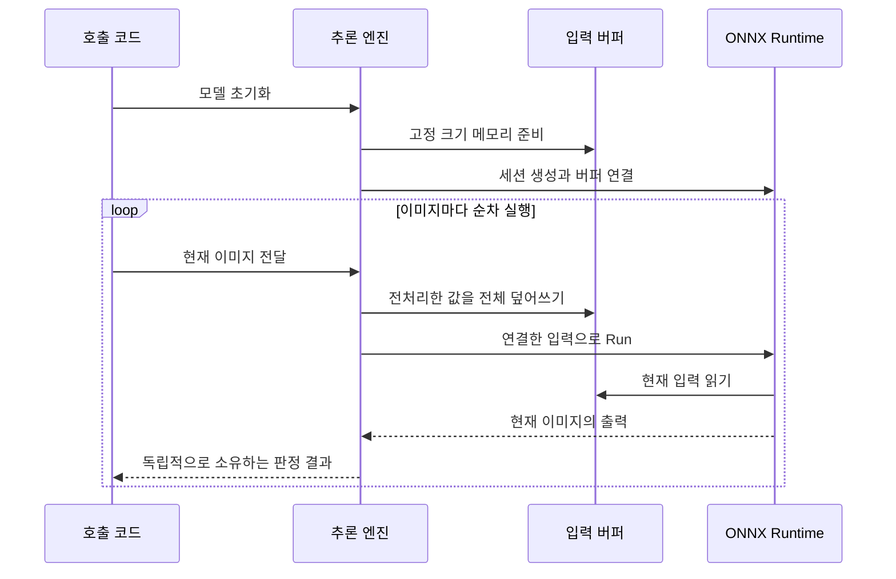

**EfficientNet 반복 추론 최적화 설계**

기준: deepstudio3, 앱 23.8, 원격 커밋 `10d92d44ecfc085aac5da52c2c712e969052112f`.
이 문서는 코드 분석에 근거한 설계다. 아래 버퍼 재사용과 선택 이미지 Grad-CAM은 아직 구현하거나 성능 측정을 완료한 기능이 아니다. 24.8의 변경은 실제 1채널 EfficientNet과 흑백 데이터 경로이며, 해당 변경을 버퍼 재사용 구현 완료로 해석하지 않는다.

**목표는 호출자가 이미지를 넘기면 엔진 내부에서 준비된 메모리로 반복 추론하는 것이다.**

사용자의 실제 입력인 1채널 grayscale, CPU, EfficientNet B0/B1, FP32, batch 1을 기준으로 한다. 버퍼는 `[1,1,H,W]`다. 새 모델은 첫 Conv도 1채널로 구성하며 RGB 확장을 수행하지 않는다. 구형 체크포인트의 RGB 확장 여부는 별도로 식별한다. 입력 크기, 크롭, 정규화는 학습 후 내보낸 JSON을 따른다. B0이라는 이유만으로 기존 모델의 입력을 224로 줄이지 않는다. 같은 모델과 같은 전처리를 유지한 상태에서 불필요한 메모리 할당과 중간 복사를 줄인다.

| 현재 코드에서 확인한 사항 | 변경할 동작 |
|---|---|
| C++ `Initialize`가 ONNX 세션을 한 번 생성 | 세션과 함께 입력 작업 공간도 한 번 준비 |
| C++ `Preprocess`가 매번 `vector<float>` 반환 | 엔진 소유 배열에 직접 기록하는 `PreprocessInto`로 변경 |
| C++에서 `cv::Mat`, 입력 shape, `Ort::Value`를 호출마다 준비 | 재사용 가능한 이미지 저장 공간과 고정 텐서 정보를 엔진에 보관 |
| Python `preprocess`가 타입 변환과 정규화 과정에서 배열 생성 | 내부 추론 경로에서 미리 만든 float32 배열에 기록 |
| GUI는 ONNX 분류기와 별개의 PyTorch 경로 사용 | GUI에도 별도의 입력 작업 공간 적용 |
| 데스크톱 체크박스, 웹 화면, 서버 요청의 Grad-CAM 기본값이 켜짐 | 신규 기본값은 꺼짐, 사용자가 요청한 이미지에 계산 |
| C++/ONNX 배포 경로에는 Grad-CAM 구현이 없음 | 지원 여부를 명확히 유지하고 PyTorch 설명 경로와 분리 |

**입력 버퍼는 모델에 전달할 숫자를 담는 메모리 공간이다.**

이미지 파일 또는 카메라 프레임을 크롭, 색상 변환, 리사이즈한 뒤 float32 NCHW 배열로 만든다. 이 최종 배열이 입력 버퍼다. float32 한 개는 4바이트다.

| 입력 예시 | 원소 개수 | 입력 버퍼 크기 |
|---|---:|---:|
| Gray, 1×1×224×224 | 50,176 | 200,704바이트 = 196 KiB |
| Gray, 1×1×240×240 | 57,600 | 230,400바이트 = 225 KiB |
| 비교용 RGB, 1×3×224×224 | 150,528 | 602,112바이트 = 588 KiB |

위 크기는 최종 입력 배열만 계산한 값이다. 모델 가중치, ONNX Runtime 내부 작업 공간, 원본 이미지, 변환 중간 이미지, 결과 메모리는 별도다.

현재 방식은 이미지가 들어올 때마다 입력 배열을 만들고, 채우고, 추론한 뒤 사용을 끝낸다. 재사용 방식은 모델 초기화 때 배열을 준비한 뒤 A 이미지의 값으로 전부 채우고 추론한다. 추론과 결과 복사가 끝나면 같은 배열을 B 이미지의 값으로 전부 덮어쓰고 다시 추론한다. 매번 현재 이미지로 모델 계산을 수행한다.



ONNX Runtime C++의 `CreateTensor`에는 호출자가 소유한 버퍼를 연결하는 API가 있다. 그 버퍼는 텐서를 사용하는 동안 살아 있어야 한다. 연결 후 `vector.resize`, 재할당, 다른 저장 공간으로의 교체를 하지 않는다. [ONNX Runtime Ort::Value](https://onnxruntime.ai/docs/api/c/struct_ort_1_1_value.html)

**C++는 엔진 하나에 실행 작업 공간 하나를 둔다.**

`VisionInference`라는 기존 클래스명은 호출부 호환을 위해 유지한다. 실제 대상은 EfficientNet이며 이름이 이전 모델 지원을 뜻하지 않는다. 새 내부 상태 `RuntimeState`에 검증된 설정, 세션, 전처리 작업 공간을 함께 보관한다. 내부 객체는 복사를 금지하고 주소가 안정적인 `unique_ptr`로 소유한다.

| 보관할 항목 | 준비 시점 | 반복 호출 시 처리 |
|---|---|---|
| 설정과 입력/출력 이름 | 모델 초기화 | 읽기만 수행 |
| `std::array<int64_t, 4>` 입력 shape | 모델 초기화 | `[1,C,H,W]` 유지 |
| `std::vector<float>` 입력 저장 공간 | 모델 초기화 | 모든 원소 덮어쓰기 |
| 입력 `Ort::Value`, `Ort::MemoryInfo` | 모델 초기화 | 같은 메모리 연결 유지 |
| 리사이즈용 `cv::Mat` | 모델 초기화 | 같은 H/W와 타입으로 재사용 |
| 색상 변환용 `cv::Mat` | 컬러 입력을 허용하는 경우에만 준비 | 실제 1채널 입력 경로에서는 사용하지 않음 |
| 분류 logits 저장 공간과 출력 `Ort::Value` | 클래스 수 검증 후 초기화 | `[1,K]` 출력 수신 |
| 반환 결과의 확률 배열 | 각 결과 생성 | 결과가 자체 소유 |

OpenCV의 `Mat::create`는 크기와 타입이 이미 맞으면 기존 저장 공간을 유지한다. 리사이즈와 색상 변환의 목적지에 이 공간을 전달한다. 원본 해상도가 바뀌면 색상 변환용 공간은 다시 준비할 수 있지만 모델의 최종 입력 크기는 그대로다. [OpenCV Mat](https://docs.opencv.org/4.x/d3/d63/classcv_1_1Mat.html)

분류 출력 `[1,K]`는 미리 준비한 출력 텐서에 받는다. C++ `Session::Run`의 호출자 제공 출력 인자를 사용한다. 출력 rank와 클래스 수를 초기화 및 실행 결과에서 검증한다. segmentation의 동적 출력은 기존 ORT 할당 경로를 유지하고 분류 출력의 크기를 강제로 적용하지 않는다. [ONNX Runtime Session::Run](https://onnxruntime.ai/docs/api/c/struct_ort_1_1detail_1_1_session_impl.html)

전처리는 원본 좌표 크롭, 채널 변환, `INTER_LINEAR_EXACT` 리사이즈, float32 변환, 255로 나누기, mean 빼기, std로 나누기, NCHW 기록 순서를 유지한다. 정규화 계수를 하나의 곱셈으로 합치거나 grayscale 변환과 resize 순서를 바꾸는 최적화는 이번 범위에 넣지 않는다. ROI는 행 간격이 원본을 따를 수 있으므로 `ptr(y)`와 실제 stride로 읽는다.

`Classify`에서 입력 채우기부터 Run 완료와 결과 복사까지 실행 mutex를 유지한다. 동일 엔진에 동시에 호출하면 직렬 처리한다. 서로 다른 이미지를 하나의 입력 버퍼에 동시에 쓰는 상황을 방지한다. 반환 확률과 클래스 이름은 결과 객체가 소유하므로 다음 추론 이후에도 이전 결과가 바뀌지 않는다. 영상 입력의 원본 메모리는 호출이 반환할 때까지 호출자가 덮어쓰지 않아야 한다.

모델 재초기화에는 lifecycle mutex를 별도로 사용한다. `Initialize`와 `Release`는 lifecycle mutex, 실행 mutex 순으로 잠근다. 후보 모델 생성과 검증은 lifecycle mutex를 잡은 상태에서 실행 mutex 밖에서 수행한다. 후보 세션과 버퍼의 준비 및 짧은 워밍업이 성공하면 실행 mutex 안에서 상태 전체를 교체한다. 실패하면 기존 세션, 설정, 버퍼를 유지한다. 워밍업 횟수는 런타임 옵션으로 두며 초기 제안 기본값은 3회다. 워밍업 출력은 사용자 판정 결과로 반환하지 않는다.

현재 `GetConfig()`의 참조 반환은 모델 교체와 동시에 사용하기 어렵다. 설정 복사본 반환으로 변경하고 `IsReady`, 정보 출력도 실행 mutex 아래에서 읽는다. getter 변경을 포함한 C++ 라이브러리와 호출 프로그램은 함께 재빌드한다. 반복 추론 중에는 설정을 외부에서 직접 수정하지 않는다.

다중 카메라의 초기 지원은 카메라별 독립 엔진과 작업 공간으로 한다. 모델 세션 메모리가 중복되는 비용을 명시한다. 세션 하나와 여러 작업 공간을 공유하는 풀은 측정상 필요할 때 별도 구현한다. 병렬 엔진 수와 엔진별 ORT 스레드 수를 함께 측정해 과도한 CPU 경쟁을 피한다.

**Python ONNX는 기존 공개 함수의 데이터 소유권을 보존한다.**

`predict_rgb()`와 `predict_file()`은 private `_preprocess_into()`를 통해 재사용 경로를 사용한다. 공개 `preprocess()`는 기존처럼 독립 배열을 반환한다. 사용자가 `a = preprocess(img_a)`를 보관하고 다음 이미지를 처리해도 `a`가 변하면 안 된다. `logits(tensor)`는 외부 입력 및 동적 batch 호출을 지원하는 기존 경로를 유지한다.

내부 작업 공간에는 연속 float32 입력 `[1,C,H,W]`, uint8 resize 목적지, 채널 변환 목적지, 분류 출력 `[1,K]`를 둔다. `np.copyto`로 CHW 뷰를 입력 버퍼에 캐스팅해 채운 뒤 `np.divide`, `np.subtract`, `np.divide`를 각각 `out=`에 같은 버퍼를 지정해 실행한다. dtype과 연산 순서는 기존 코드와 같게 유지한다. OpenCV `dst`는 shape/type을 정확히 맞추고 실제 반환 배열이 의도한 공간인지 검증한다.

CPU `OrtValue`를 NumPy 배열에 연결하고 I/O binding으로 고정 입력과 출력을 바인딩한다. NumPy 배열과 OrtValue 모두 분류기가 소유하며 반복 호출 동안 참조를 유지한다. CPU `ortvalue_from_numpy`는 NumPy 메모리를 공유할 수 있으며 ONNX Runtime은 입력과 출력 OrtValue 바인딩 API를 제공한다. [ONNX Runtime Python API](https://onnxruntime.ai/docs/api/python/api_summary.html)

I/O binding이 CPU에서 항상 더 빠르다고 가정하지 않는다. 같은 입력 버퍼를 사용하는 `session.run` 경로와 비교한다. 측정상 이점이 없으면 입력 재사용을 유지하면서 단순 `run` 경로를 선택할 수 있다. 이 경우 출력 메모리는 ORT가 관리하며 출력까지 재사용했다고 보고하지 않는다.

Python에서도 입력 채우기, Run, 결과 리스트 생성까지 하나의 lock으로 보호한다. 예외가 발생하면 그 호출은 실패로 반환하고 이전 logits를 새 이미지의 결과처럼 반환하지 않는다. 다음 호출은 입력 전체를 다시 채운다. public config는 내부 설정의 복사본으로 노출하거나 읽기 전용으로 제공해 버퍼 shape와 설정의 불일치를 막는다.

**GUI와 Grad-CAM에는 별도의 경로가 필요하다.**

현재 GUI `InferenceOperations._run_custom_inference()`는 매 이미지마다 transform을 구성하고 PyTorch 입력 텐서를 만든다. 모델 로딩 시 전처리 설정을 확정하고 EfficientNet 분류용 CPU 작업 공간을 만든다. NumPy 입력과 CPU Tensor가 공유하는 저장 공간을 엔진이 소유하고 같은 전처리 함수를 사용한다. 일반 추론은 `torch.inference_mode()`를 유지한다. 다른 태스크에 이 분류 전용 경로를 일괄 적용하지 않는다.

GPU 모드에서는 CPU 입력 재사용만으로 전송이 없어지지 않는다. GPU 입력 저장 공간은 별도로 재사용하고, 이전 GPU 연산이 끝나기 전에 덮어쓰지 않도록 동일 스트림 순서와 CPU 원본 수명을 보장해야 한다. CPU 구현을 검증한 뒤 별도의 GPU 측정과 동기화 테스트로 다룬다.

Grad-CAM 모드는 `off`, `selected`, `all`로 구분한다. 새 설정은 `off`를 기본값으로 한다. 저장된 사용자의 명시적 선택은 존중한다. 기존 API의 `gradcam=false/true`는 각각 `off/all`로 호환하며 값이 생략된 신규 요청의 기본값은 `off`로 통일한다.

`selected`는 이미 판정한 이미지에서 사용자가 설명을 요청할 때만 PyTorch Grad-CAM을 수행한다. ONNX 분류만 배포한 C++ 실행 파일에 이 기능이 자동으로 생기는 것은 아니다. 설명 기능에는 대응하는 PyTorch 체크포인트와 별도의 설명 실행기가 필요하다.

설명 작업에는 결과 ID, 모델 식별자, 전처리 설정, 대상 클래스, 선택 이미지의 독립 복사본 또는 검증 가능한 원본 참조를 전달한다. 일반 추론의 재사용 입력 배열을 설명 작업에 그대로 보관하지 않는다. 모델을 바꾼 뒤 이전 이미지의 설명을 요청하면 기존 모델을 명시적으로 사용하거나 모델 불일치를 반환한다. 다른 모델로 조용히 계산하지 않는다.

설명 실행기는 일반 추론 모델의 Grad-CAM hook 및 gradient 상태를 공유하지 않는다. 기본 판정을 먼저 표시하고 선택한 설명을 나중에 표시하며 설명 계산 시간은 별도로 기록한다. 같은 CPU에서 동시에 계산하면 판정 속도도 영향을 받으므로 설명은 기본적으로 유휴 시간에 수행하고 작업 수를 제한한다. 불량만 자동 설명하는 모드는 불량 클래스 목록이나 판정 규칙이 명시된 이후 추가한다. 클래스 번호만으로 OK/NG를 추정하지 않는다.

**사용자 호출부는 모델을 한 번 초기화하고 프레임마다 Classify를 호출한다.**

다음은 유지할 공개 API의 사용 예시다. `GetNextFrame`과 `DisplayResult`는 사용자 프로그램에서 제공하는 함수를 뜻한다. 이 문서에 의해 엔진 내부 최적화가 적용되는 것은 아니다.

```cpp
VisionInference engine;
if (!engine.InitializeFromJson("model.json")) {
    throw std::runtime_error("모델 초기화 실패");
}

cv::Mat frame;
while (GetNextFrame(frame)) {
    const ClassifyResult result = engine.Classify(frame);
    DisplayResult(result);
}
```

버퍼 크기와 수명은 엔진이 관리한다. 사용자가 프레임마다 `vector<float>`나 `Ort::Value`를 만들 필요가 없다. `cv::Mat`을 이미 가진 카메라 경로는 파일 저장 후 다시 읽는 작업 없이 전달한다. 파일 경로 추론은 디코딩 시간이 별도 발생한다.

모델에 필요한 최종 입력 크기는 JSON과 ONNX를 대조해 초기화할 때 확정한다. 크롭은 JSON 설정에 따라 수행한다. 원본 크기가 모델 입력 크기와 같을 때의 resize 생략은 전처리 일치 검증을 통과한 경우에만 허용한다. 원본 크기가 다르면 모델 규격에 맞게 리사이즈해야 한다. 모델 입력 크기 자체를 변경하려면 재초기화 및 해당 크기의 모델 검증이 필요하다.

**속도와 정확도는 같은 조건의 변경 전후 실행으로 확인한다.**

기준은 23.8의 동일 체크포인트, 동일 ONNX, 동일 JSON, 동일 이미지, 동일 실행 장비와 라이브러리 버전이다. 입력 메모리 재사용과 스레드 변경을 한 번에 섞지 않고 먼저 같은 스레드 수에서 재사용 전후를 비교한다. 그다음 ORT 스레드 1/2/4/8 및 실제 동시 카메라 수를 비교한다. 모델별로 가장 빠른 값이 다를 수 있다.

| 측정값 | 의미 |
|---|---|
| `load_ms`, `warmup_ms` | 한 번 발생하는 준비 시간 |
| `decode_ms` | 파일 읽기와 디코딩 시간, 메모리 입력에는 해당 없음 |
| `queue_ms` | 작업 큐 또는 실행 lock을 기다린 시간 |
| `preprocess_ms` | 크롭부터 입력 텐서 준비까지 |
| `model_ms` | Run 실행 구간 |
| `postprocess_ms` | 출력 검증, 확률 변환, 독립 결과 생성 |
| `inference_ms` | 기존 C++ 의미 유지: 전처리 + 모델 + 후처리 |
| `call_total_ms` | 호출 진입부터 반환까지, lock 대기 포함 |
| `gradcam_ms` | 요청된 설명 계산 시간 |
| `display_ms` | UI 이미지 변환 및 표시 비용, 엔진 시간과 별도 |

벤치마크는 초기 제안값으로 준비 실행 30회 후 1,000회 이상, 변경 전후 교대 순서로 최소 3라운드 측정한다. 평균, p50, p95, p99, 첫 실제 프레임 시간을 별도로 보고한다. 고정 이미지 모델 실행과 여러 실제 이미지의 전체 처리 시간을 구분한다. 대용량 per-frame 로그는 시간 측정 구간 밖에서 저장한다.

입력 배열 재사용은 메모리 할당과 임시 복사를 줄이는 작업이다. CNN의 합성곱 연산량은 그대로다. 예를 들어 전체 10ms 중 줄일 수 있는 부분이 0.5ms라면 그 부분을 전부 없애도 9.5ms다. 이 숫자는 원리 설명용 가정이며 실제 프로젝트 측정값이 아니다. ONNX 내부 작업 공간, 파일 디코딩, 결과 생성까지 전체 호출에서 할당이 0회가 된다고 주장하지 않는다.

정확도 검증에서는 먼저 전처리된 float32 입력이 기존 구현과 원소별로 같은지 검사한다. 같은 backend와 같은 설정의 버퍼 변경 전후 logits는 우선 완전 일치를 확인하고, 수치 차이가 있으면 원인을 기록한다. backend 간 비교는 기존 허용 오차 계약을 적용하되 이미지별 최종 클래스와 실제 판정 임계값 통과 여부도 별도로 비교한다. 전체 accuracy 또는 confusion matrix만 같다는 이유로 동일성을 인정하지 않는다.

| 필수 검증 | 검출할 오류 |
|---|---|
| 검정, 흰색, 체크무늬, 서로 다른 실제 이미지를 교대로 입력 | 이전 프레임 데이터 또는 출력 재사용 오류 |
| 입력 공간을 NaN으로 채운 뒤 전처리 | 일부 원소를 덮어쓰지 않은 오류 |
| RGB/gray, BGR/BGRA, 비연속 ROI, 홀수 크롭 | 채널 순서, stride, 크롭 좌표 오류 |
| B0/B1, 채널 및 클래스 수가 다른 모델 재초기화 | 이전 shape, 출력 공간, 클래스 이름 잔존 |
| 잘못된 모델 로딩 및 추론 중 오류 후 다음 정상 호출 | 상태 손상, 이전 결과의 잘못된 반환 |
| 이전 결과 보관 후 수백 번 추가 추론 | 반환 값이 내부 재사용 공간을 참조하는 오류 |
| 동시 호출, 모델 교체, Release 조합 | 데이터 경쟁, 사용 후 해제, deadlock |
| 워밍업 후 고정 shape 반복과 할당 계측 | 입력 저장 공간과 텐서 래퍼의 불필요한 재생성 |
| GUI 일반 추론과 선택 Grad-CAM 교대 | 설명 hook, gradient, 공유 입력으로 인한 간섭 |

포인터 값이 반복해서 같다는 것만으로 재할당이 없었다고 판단하지 않는다. 메모리 할당기는 해제된 주소를 다시 사용할 수 있다. 작업 공간 생성 횟수와 소유권을 함께 계측하고 필요한 경우 할당 추적기로 확인한다. C++은 실제 OpenCV 및 ONNX Runtime을 연결한 실행과 수명/경쟁 검사를 포함한다. Python mock 테스트만으로 런타임 검증을 대체하지 않는다.

**구현은 다음 파일 단위로 진행할 수 있다.**

| 순서 | 대상 파일 | 작업 |
|---|---|---|
| 1 | `cpp/include/vision_inference.h`, `cpp/src/vision_inference.cpp` | 상태 소유권, 입력/분류 출력 공간, 동기화, 재초기화, 시간 측정 |
| 1 | `cpp/include/opencv_preprocess.h` | caller-owned 목적지에 기록하는 전처리 함수, 기존 호출 호환 |
| 2 | `python/onnx_classifier.py`, `python/opencv_preprocess.py` | 내부 재사용 경로, 공개 배열 소유권 보존, I/O binding 비교 |
| 3 | `gui/core/inference_loading.py`, `gui/core/inference_engine.py` | EfficientNet 분류 전처리 준비, CPU 작업 공간, 설명 상태 분리 |
| 3 | `gui/widgets/inference_widget.py`, `web/src/inference.tsx` | 신규 기본 CAM off, 선택 이미지 설명 요청 및 상태 표시 |
| 3 | `webapp/server.py`, `webapp/worker.py` | CAM 요청 기본값 통일, 선택 설명 작업 계약 |
| 4 | `tools/efficientnet_benchmark.py`, C++ smoke 실행, 관련 runtime 테스트 | 버퍼 변경 전후, 단계별 시간, 입력과 개별 판정 비교 |

현재 환경에서는 Torch, OpenCV, ONNX Runtime과 C++ 관련 의존성이 갖춰지지 않아 이 설계의 실제 추론 속도와 수치 일치 검증을 수행하지 못했다. 문서 검토와 실행 검증 상태를 구분한다. 기능 구현 후 실제 실행 결과를 확보하기 전에는 속도 개선률, 정확도 보존, 전체 검증 완료를 확정해서 보고하지 않는다.
