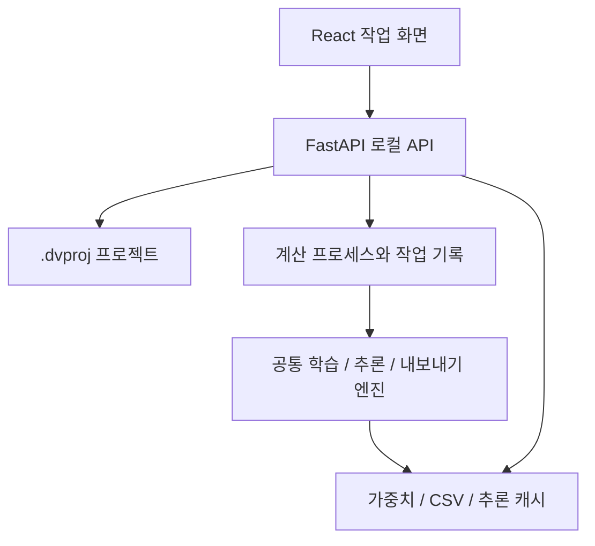

# Deep Vision Studio React

첫 로컬 웹 버전은 React 화면과 FastAPI 서버를 같은 PC에서 실행한다. 기본 주소는 `http://127.0.0.1:8765`다. 클라우드 계정이나 외부 서버가 필요하지 않다. 기존 PySide6 화면은 `gui/main.py`로 계속 실행할 수 있으며 두 화면은 같은 프로젝트 형식과 계산 코드를 사용한다.

## 설치와 실행

GitHub Releases의 **Deep-Vision-Studio-React-v9.1.zip**을 새 폴더에 푼다. GitHub의 일반 **Source code ZIP**에는 빌드된 React 화면이 없으므로 아래 개발자 빌드가 추가로 필요하다.

v8.0에서 `0`, `nish` 등이 명령이 아니라는 배치 오류가 발생했다면 v8.1 릴리스에 별도로 첨부한 `start_web.bat`을 기존 `DeepVisionStudio/start_web.bat`에 덮어써도 된다. 이번 시작 오류 수정에는 Python 환경과 데이터의 재설치가 필요하지 않다. 앱 전체를 v8.1로 갱신하려면 실행용 ZIP을 사용한다.

Windows에서는 Python 3.11 64비트를 설치한 뒤 `DeepVisionStudio/start_web.bat`을 더블클릭한다. Python 실행기 `py` 또는 PATH의 `python`을 자동으로 찾는다. Python 자체가 없으면 설치 안내를 표시한다.

최초 실행은 가상환경 생성, pip 패키지 설치, 패키지 호환성과 실제 import 검사, 브라우저 열기 순서다. 별도로 pip 명령을 입력할 필요가 없다. 활성 가상환경이나 Conda 환경이 있으면 해당 환경을 사용하고, 없으면 프로젝트 폴더의 `.venv`를 만들거나 재사용한다. NVIDIA GPU가 있으면 CUDA용 PyTorch를 자동 설치한다. 이전 CPU 전용 환경도 GPU용으로 자동 복구하며, GPU가 없는 PC는 CPU 실행을 유지한다.

Linux 또는 터미널에서:

```bash
python start_web.py
```

다음 실행은 설치 목록과 Python 및 패키지 버전을 확인한 뒤 기존 환경을 재사용한다. 설치 목록 변경, 패키지 삭제 또는 설치 실패 시에는 다시 설치한다. 실패한 설치를 완료 상태로 기록하지 않으며 `.venv/deep-studio-setup.log`에 출력이 남는다. 활성 가상환경을 사용했다면 그 환경 폴더에 로그를 기록한다. 두 창에서 동시에 설치하지 못하도록 잠그고, 실행 중인 서버가 있으면 패키지 변경 전에 종료를 안내한다.

브라우저만 닫으면 작업은 계속 실행된다. 서버 터미널을 닫거나 Ctrl+C를 누르면 중단을 요청하므로 학습 중에는 서버 창을 유지한다.

설치만 먼저 완료하려면:

```bash
python start_web.py --setup-only
```

기존에 정상 동작하는 CUDA 환경은 그대로 재사용한다. GPU 환경을 명시적으로 준비하려면 `start_web.bat --accelerator cuda`를 실행한다. 드라이버 580 이상은 CUDA 13.0, 이전 호환 드라이버는 CUDA 12.6 패키지를 사용한다. 설치 후 실제 GPU 합성곱과 역전파를 검사하며, 검사에 실패하면 CPU로 전환하지 않고 원인을 표시한다. 학습 화면에서 `자동 (GPU 우선)` 또는 `cuda:0`을 선택한다. `--accelerator cpu`는 설치 과정에서 GPU 전환을 요구하지 않는 옵션이며 학습 장치는 프로젝트 설정을 따른다.

다른 포트 또는 브라우저 자동 열기 해제:

```bash
python start_web.py --port 8770 --no-browser
```

Python 패키지와 필요한 공식 모델 가중치는 처음 준비할 때 인터넷이 필요하다. 준비된 환경에서는 로컬 가중치와 데이터로 실행할 수 있다. React, CSS, 아이콘과 글꼴 설정은 외부 CDN을 사용하지 않는다. 실행용 ZIP에는 Node.js나 npm이 필요하지 않다. 직접 관리하는 Python 환경에서는 기존 `python run_web.py`도 계속 사용할 수 있다.

## 작업 화면

| 화면 | 첫 버전 기능 |
|---|---|
| 프로젝트 | 작업 유형별 새 프로젝트, 기존 `.dvproj` 열기, 최근 파일 복원 |
| 데이터셋 | 데이터 루트 연결, train/val/test 이미지 수, 이미지 탐색, 클래스 추가, 삭제 영향 미리보기와 백업 삭제 |
| 학습 | 공식 CustomCSP 파인튜닝/이어학습, Custom CSP, PatchCore, Freeze, 클래스 가중치, Best 지표 선택, 증강, 손실 그래프, 로그, 실행 기록 및 CSV |
| 추론 | 폴더 일괄 추론, 이미지별 저장 결과, 좌측 상단 판정 라벨, 확률, 추론/Grad-CAM 시간 분리, 히트맵 범위와 불투명도, 미리보기 저장 |
| 내보내기 | 체크포인트에서 ONNX와 배포 JSON 생성, ONNX Runtime 검증, 결과 다운로드 |
| Defect Gen | 7종 표면 결함, 강도/면적/시드/거칠기/경계/혼합 설정, ROI, 참조 질감, 원본 정밀도와 변경 마스크/레시피 저장 |

파일 찾아보기는 서버가 실행 중인 PC의 파일 시스템을 보여준다. 이미지를 브라우저로 업로드하지 않고 로컬 경로를 직접 사용한다. 데이터 복사와 라벨 작성은 기존 파일 도구에서 수행하고, 데이터셋 화면에서 루트를 연결한다. 탐지와 분할의 라벨 형식은 기존 엔진과 같다. 프로젝트 및 데이터 형식은 [ARCHITECTURE.md](ARCHITECTURE.md)를 참조한다.

## Best와 계산 결과

Best 선정은 React에서 다시 계산하지 않는다. 기존 `model_selection.py` 정책과 `publish_best` 결과가 가중치 이름, CSV, 프로젝트 기록과 화면에 공통으로 적용된다. Best 손실 카드는 그 에폭의 실제 기록만 사용한다. 이어학습 이력은 배열 위치가 아닌 저장된 `epoch` 번호로 대응한다. 이전 Best의 손실 이력이 없으면 값을 추측하지 않고 `—`로 표시한다. PatchCore는 한 번의 메모리 뱅크 구성 결과이며 Best loss 경쟁이 아니다.

에폭별 시간과 총 학습시간은 기존 `results.csv`, `best_result.csv`, `training_summary.csv`와 학습 로그에 그대로 기록한다. 작업 로그 아래의 전체 작업 시간에는 프로세스 시작과 모델 준비도 포함되므로 엔진의 총 학습시간과 다를 수 있다. 모델별 Best 선정 근거는 루트 [README.md](../README.md)의 기존 설명을 유지한다.

추론 시작 시 모델을 한 번 로드하고 이미지들을 순서대로 처리한다. 결과 JSON과 원본/미리보기/활성화 지도는 작업별 디스크 캐시에 저장한다. 이미지 클릭, 확대, 히트맵 범위 변경은 저장된 결과만 읽는다. 범위 변경은 약 180 ms 지연 후 마지막 설정을 반영하며 모델을 다시 호출하지 않는다. Grad-CAM을 계산하지 않았거나 실패한 이미지는 그 사실을 표시한다. ONNX 추론은 현재 C++/CLI 경로를 사용하며 웹의 추론 입력은 `.pt` 체크포인트다.

히트맵의 최소 강도 0%는 계산된 0값도 표시한다. 모델이 실제로 보지 않은 영역은 기존 유효 마스크를 유지한다. 표현 영역을 임의의 결과로 채우지 않는다. PatchCore에서는 Grad-CAM 대신 모델 자체의 이상 맵을 사용한다.

## 실행과 저장 구조



- `web/src/`: 화면과 API 클라이언트. Best 선정과 모델 추론 코드를 포함하지 않는다.
- `webapp/server.py`: 프로젝트 및 파일 API, 입력 검증, 동일 출처 요청 확인, 캐시 렌더링과 정적 파일 제공.
- `webapp/jobs.py`: 계산 프로세스 실행, 이벤트 커서, 중단, 상태 복구. 동시에 하나의 계산 작업만 허용한다.
- `webapp/worker.py`: 작업 종류에 따라 공통 엔진을 호출한다. Qt를 가져오지 않는다.
- `gui/core/training_engine.py`: 콜백 이벤트와 협력적 중단 인터페이스.
- `gui/core/qt_training.py`: 같은 엔진을 기존 QThread 화면에 연결한다. 기존 GUI의 이벤트 루프와 수명을 유지한다.
- `run_web.py`: localhost 바인딩, 서버 중복 실행 방지, 브라우저 열기와 오류 안내.
- `start_web.bat` / `start_web.py` / `webapp/bootstrap.py`: Python 탐색, 가상환경과 패키지 자동 설치, 설치 검사와 서버 실행.

사용자별 상태 기본 경로는 `~/.deep-vision-studio-react`이며 `DEEP_STUDIO_STATE_DIR`로 변경할 수 있다. 프로젝트 데이터는 사용자가 선택한 프로젝트 및 데이터 폴더에 저장하고, 상태 폴더에는 최근 프로젝트와 작업별 로그/캐시를 저장한다.

```text
jobs/<작업 ID>/job.json          작업 상태와 결과 경로
jobs/<작업 ID>/request.json      실행 설정 스냅샷
jobs/<작업 ID>/events.jsonl      진행 이벤트
jobs/<작업 ID>/console.log       엔진 실행 로그
jobs/<작업 ID>/result.json       최종 결과
jobs/<작업 ID>/results/          이미지별 JSON 및 NumPy 캐시
```

브라우저 새로고침 후에도 서버 작업은 유지되며 저장된 로그를 다시 읽는다. 서버 종료 시 현재 이미지나 배치의 안전한 중단 지점까지 기다린다. ONNX 변환처럼 중간 중단을 지원하지 않는 연산은 현재 단계를 마친다. 새 서버가 시작되어도 이전 계산 프로세스가 종료 중이면 파일 잠금으로 새 계산과 설정 변경을 차단한다. 불완전한 작업은 중단 상태로 표시하며, 늦게 도착한 최종 결과는 다시 읽어 복원한다. 모델 학습을 자동 재개하지 않는다.

프로젝트 저장은 기존 임시 파일과 원자 교체를 사용한다. 계산 시작 시 프로젝트 파일의 해시를 기록하고, 학습 중 외부에서 프로젝트를 변경했다면 원본을 덮어쓰지 않는다. 새 학습 기록은 작업 폴더의 `project_result.json`에 보존한다. 이 파일은 진단 및 수동 기록 복구용 스냅샷이며 일반 프로젝트 열기 대상으로 사용하지 않는다. 같은 프로젝트를 데스크톱과 웹에서 동시에 편집하는 작업 방식은 권장하지 않는다.

추론 캐시는 자동 삭제하지 않는다. 최근 30개 작업이 UI 목록에 표시된다. 대용량 데이터 작업 후 캐시를 정리할 때에는 서버를 종료하고 필요한 결과를 따로 보관한 뒤 해당 작업 폴더를 정리한다. 폴더 일괄 처리의 한도는 작업당 100,000장이다.

## 개발자 실행과 검증

Node.js 22.12 이상 환경에서:

```bash
cd web
npm ci
npm run build
cd ..
python run_web.py
```

프런트엔드를 수정할 때에는 Python 서버를 실행한 상태에서 `web` 폴더의 `npm run dev`를 별도 터미널에서 실행한다. Vite는 `127.0.0.1`에만 바인딩하며 `/api` 요청을 기본 Python 서버 포트 8765로 전달한다. 개발 서버 포트의 Origin과 Host를 함께 유지하므로 동일 출처 검사에 맞는다.

```bash
python -m pytest tests/ -v
python tools/web_asset_smoke.py
python tools/package_web.py --output release
```

CI는 Windows/Linux의 기존 GUI와 모델 회귀 검사, 웹 프로세스 통합 검사, Python lint, React TypeScript/정적 빌드, FastAPI 정적 자산 라우트, C++ 계약 검사를 실행한다. Linux에서 생성한 배포 ZIP을 Windows에서 그대로 풀어 CP949/UTF-8 명령창의 배치 실행, 실제 자동 설치, 서버와 정적 파일의 HTTP 응답도 검사한다. 검증한 ZIP의 SHA-256을 유지하여 재포장 없이 공개한다. 브라우저 클릭이나 화면 스크린샷 검사를 자동 통합 검사로 대체했다고 주장하지 않는다. 실제 CUDA 하드웨어 성능과 사용자 데이터셋의 정확도는 별도 측정 대상이다.

구현 참고: [FastAPI lifespan](https://fastapi.tiangolo.com/advanced/events/), [Vite production build](https://vite.dev/guide/build).
